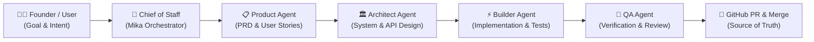

# Dream Academy

> **Single Source of Truth** untuk pengembangan platform Dream Academy menggunakan sistem **AI-Agent-Assisted Development**.

---

## 📌 Ringkasan Proyek

**Dream Academy** adalah platform pembelajaran dan pengembangan potensi generasi muda yang dirancang untuk memberikan pengalaman edukasi interaktif, personal, dan terstruktur.

Repository ini berfungsi sebagai **pusat kebenaran tunggal (*Single Source of Truth*)** untuk seluruh arsitektur sistem, basis kode aplikasi, spesifikasi API, skema database, dokumentasi produk, dan protokol pengembangan AI Agent.

---

## 🤖 Model AI-Agent-Assisted Development

Pengembangan proyek ini diorkestrasi secara terstruktur menggunakan ekosistem **Multica AI** dengan kolaborasi antara *human founder/developer* dan tim *autonomous AI agents*.

### Alur Kerja Utama (*Core Workflow*)



1. **Chief of Staff (Mika - Orchestrator):** Mengoordinasikan alur kerja, mendistribusikan tugas antar agent, memantau dependensi, dan menjaga kepatuhan protokol.
2. **Product Agent:** Merumuskan spesifikasi produk, *Product Requirements Document* ([`docs/PRD.md`](docs/PRD.md)), *user stories*, dan *acceptance criteria*.
3. **Architect Agent:** Merancang arsitektur sistem ([`docs/ARCHITECTURE.md`](docs/ARCHITECTURE.md)), skema basis data ([`docs/DATABASE.md`](docs/DATABASE.md)), kontrak API ([`docs/API.md`](docs/API.md)), dan rencana implementasi teknis ([`docs/IMPLEMENTATION_PLAN.md`](docs/IMPLEMENTATION_PLAN.md)).
4. **Builder Agent:** Mengimplementasikan kode program, *component utilities*, dan modul aplikasi pada *feature branch* yang terisolasi.
5. **QA Agent:** Menjalankan pengujian otomatis, validasi regresi, audit keamanan, verifikasi *acceptance criteria*, dan menyiapkan *pull request*.

---

## 🏛️ GitHub Sebagai Source of Truth

Seluruh aspek teknis dan operasional wajib tercatat dan tersinkronisasi di GitHub:
- **Code & Logic:** Seluruh implementasi kode berada di direktori `src/`.
- **Automated Tests:** Seluruh test suite berada di direktori `tests/`.
- **Engineering Constitution:** Panduan dan aturan operasional AI wajib merujuk ke [`docs/AI_RULES.md`](docs/AI_RULES.md).
- **Technical Documentation:** Seluruh keputusan arsitektur, PRD, API, skema database, dan rencana implementasi disimpan dalam folder `docs/`.
- **Standardized Review:** Setiap perubahan kode wajib melalui Pull Request menggunakan template [`.github/pull_request_template.md`](.github/pull_request_template.md).

---

## 📁 Struktur Direktori

```text
dream-academy/
├── .github/
│   ├── workflows/                      # GitHub Actions & CI/CD pipelines
│   │   └── ci.yml
│   └── pull_request_template.md        # Template standar Pull Request
├── docs/
│   ├── PRD.md                          # Product Requirements Document
│   ├── ARCHITECTURE.md                 # Architecture & System Design
│   ├── DATABASE.md                     # Database Schema & Data Models
│   ├── API.md                          # API Contracts & Endpoints
│   ├── IMPLEMENTATION_PLAN.md          # Phased Roadmap, Builder Tasks & QA Checklist
│   └── AI_RULES.md                     # Engineering Constitution untuk AI Agents
├── src/                                # Source code aplikasi
├── tests/                              # Unit, integration, & e2e test suites
├── README.md                           # Panduan utama repository
└── .gitignore                          # Standard git ignore rules
```

---

## 📜 Panduan Kontribusi AI Agent

Setiap AI Agent yang beroperasi pada repositori ini **wajib** mematuhi konstitusi yang tercantum di [`docs/AI_RULES.md`](docs/AI_RULES.md). Pelanggaran terhadap aturan keselamatan dan integritas arsitektur tidak diperbolehkan.
