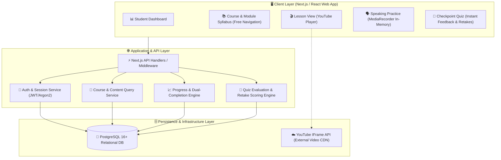

# System Architecture & Technical Design — Dream Academy

> **Version:** 1.0 (MVP Foundation Architecture)  
> **Status:** APPROVED / Source of Truth for Implementation  
> **Author:** Architect Agent / Technical Lead  
> **Target Audience:** Builder Agent, QA Agent, & Founder  
> **Last Updated:** 2026-09-02

---

## 1. Executive System Overview

**Dream Academy** dibangun sebagai aplikasi web responsif modern (*Responsive Web Application*) dengan arsitektur **Modular Layered Architecture (Clean Architecture Principles)**. Sistem dirancang untuk memberikan pengalaman belajar yang mulus, cepat, aman, dan tanpa friksi bagi pembelajar bahasa Inggris di Indonesia.

Arsitektur MVP memprioritaskan:
1. **Kehandalan & Kesederhanaan (*Simplicity & Reliability*):** Menggunakan stack teknologi teruji dengan *zero operational overhead*.
2. **Kepatuhan Ketat pada PRD v1.1:** Navigasi bebas (*Free Navigation*), evaluasi ketuntasan ganda (*Dual-Trigger Completion*), perekaman audio lokal di browser (*Zero Cloud Audio Storage*), dan integrasi pemutar video YouTube.
3. **Kesiapan Eksekusi untuk Builder Agent:** Batasan modul, kontrak antarmuka (*interface contracts*), dan pola penanganan error didefinisikan secara presisi.



---

## 2. Tech Stack Selection & Decisions

| Komponen | Teknologi Terpilih | Justifikasi Arsitektur |
| :--- | :--- | :--- |
| **Frontend Framework** | **Next.js 14+ (App Router) / React 18+ (TypeScript)** | Server-side rendering untuk performa instan, App Router untuk perutean modular, dan TypeScript untuk *type-safety* ujung-ke-ujung. |
| **Styling & UI** | **TailwindCSS + Radix UI / Shadcn UI** | Komponen UI bersih, aksesibel (WCAG 2.1 AA compliant), responsif pada perangkat seluler dan desktop. |
| **Backend / API** | **Next.js Route Handlers / Modular Services (TypeScript)** | Arsitektur fullstack TypeScript terpadu; memudahkan deployment, konsistensi tipe DTO antara frontend dan backend. |
| **Database ORM / Query** | **PostgreSQL 16+ & Prisma ORM / Drizzle** | Relasional murni, integritas referensial kuat (FK & constraints), migrasi skema terstruktur dan type-safe. |
| **Autentikasi** | **JWT (HttpOnly Secure Cookie) + Argon2id / bcrypt** | Stateless, aman dari serangan XSS/CSRF, tidak membebani memori session backend. |
| **Video Engine** | **YouTube Embedded IFrame Player API** | Distribusi video cepat via CDN YouTube, bebas biaya hosting bandwidth, dan mendukung event listener playback. |
| **Audio Recording** | **Browser MediaRecorder Web API** | Murni *client-side* di memori RAM browser (`Blob` / `AudioContext`); **nol transmisi data ke server**. |
| **Testing Suite** | **Vitest / Jest (Unit) + Playwright (E2E)** | Eksekusi test cepat dan simulasi alur belajar siswa dari dashboard hingga kuis. |

---

## 3. Frontend Architecture

### 3.1. Directory & Component Layout
```text
src/
├── app/                                # Next.js App Router Pages
│   ├── (auth)/                         # Auth routes: /login, /register
│   ├── (dashboard)/                    # Protected routes: /dashboard, /courses
│   │   ├── dashboard/page.tsx
│   │   └── courses/
│   │       ├── [courseSlug]/page.tsx
│   │       └── lessons/[lessonSlug]/page.tsx
│   └── layout.tsx
├── components/                         # Reusable UI Components
│   ├── ui/                             # Base primitives (Button, Card, Modal, Input, Progress)
│   ├── dashboard/                      # Dashboard widgets (ProgressSummary, CourseCard)
│   ├── course/                         # SyllabusList, ModuleAccordion
│   ├── lesson/                         # VideoPlayer, KeyTakeaways, TranscriptTab
│   ├── speaking/                       # AudioRecorder, AudioPlayback, ScenarioPrompt
│   └── quiz/                           # QuizQuestionCard, OptionSelector, ScoreBanner, AttemptHistory
├── lib/                                # Core utilities, DB client, Auth helpers
├── services/                           # Client-side API fetchers (typed)
├── types/                              # Shared TypeScript Interfaces & DTOs
└── hooks/                              # Custom React Hooks (useAudioRecorder, useYouTubeTracker)
```

### 3.2. State & Cache Management
- **Server State:** Menggunakan React Server Components (RSC) untuk data read-heavy (silabus kursus, teks lesson) + SWR/React Query untuk mutasi interaktif (progress update, quiz submit).
- **Client UI State:** Local React state (`useState`, `useReducer`) untuk interaksi transient (audio recording playback, quiz answering flow, tab selection).

---

## 4. Backend & Service Layer Architecture

Penerapan pola **Clean Layered Architecture**:
1. **Route Handlers (`/api/v1/*`):** Menerima HTTP request, memvalidasi payload menggunakan schema parser (Zod), dan memetakan response.
2. **Service Layer (`src/services/*`):** Menjalankan logika bisnis murni (*business rules*):
   - `AuthService`: Verifikasi kredensial, hashing password, penerbitan token.
   - `CourseService`: Pengambilan data kursus, modul, dan lesson berurutan.
   - `QuizService`: Koreksi jawaban kuis, perhitungan skor, pencatatan attempt, dan agregasi *highest score*.
   - `ProgressService`: Evaluasi kondisi ganda ketuntasan lesson (`video_completed && best_score >= 70`) dan kalkulasi persentase kursus.
3. **Data Access Layer (`src/lib/db/*`):** Eksekusi query database melalui ORM/Client dengan transaksi atomik jika melibatkan mutasi多tabel.

---

## 5. Detailed Subsystem Design

### 5.1. YouTube Video Player & Completion Tracking Architecture
- **Mekanisme Integrasi:** Memanfaatkan library pembungkus responsif (`react-youtube` atau native `window.YT.Player`).
- **Pelacakan Video Selesai (*Video Completion Condition*):**
  1. Komponen mendengarkan event `onStateChange` dari YouTube Player.
  2. Saat event `YT.PlayerState.ENDED` (kode `0`) terpicu ATAU waktu tonton mencapai threshold $\ge 90\%$ durasi total, klien mengirimkan mutasi `POST /api/v1/lessons/:id/video-complete`.
  3. Backend mencatat `video_completed = true` pada tabel `lesson_progress`.
- **Fault-Tolerance & Resilience:** Jika YouTube API gagal memicu event (karena ad-blocker atau restriksi browser), disediakan tombol cadangan *"Konfirmasi Selesai Menonton"* setelah video dimainkan minimal 10 detik agar siswa tidak terblokir.

### 5.2. In-Browser Local Speaking Practice Architecture (PRD-04)
- **Zero-Storage Philosophy:** Berkas audio **TIDAK PERNAH** dikirim ke backend, cloud bucket (S3), atau database.
- **Alur Kerja Client-Side:**
  ```mermaid
  sequenceDiagram
      autonumber
      actor Student as Siswa
      participant UI as Speaking UI Component
      participant API as Browser MediaRecorder API
      participant Mem as Browser RAM (Blob Memory)

      Student->>UI: Klik "Mulai Rekam"
      UI->>API: navigator.mediaDevices.getUserMedia({ audio: true })
      API-->>UI: Audio Stream Active (Indikator visual merekam)
      Student->>UI: Berbicara sesuai prompt latihan
      Student->>UI: Klik "Hentikan Rekam"
      UI->>API: mediaRecorder.stop()
      API->>Mem: Buat new Blob(audioChunks, { type: 'audio/webm' })
      Mem-->>UI: Generate URL.createObjectURL(blob)
      UI-->>Student: Tampilkan Audio Player Lokal (Tombol Play/Pause & Retake)
      Student->>UI: Klik "Putar Ulang" -> Dengarkan Suara Sendiri
      Student->>UI: Klik "Rekam Ulang" -> URL.revokeObjectURL() & Reset State
  ```
- **Penanganan Edge Case:**
  - Izin mikrofon ditolak: Tampilkan pesan edukatif; siswa tetap dapat membaca teks latihan dan melanjutkan belajar tanpa hambatan.

### 5.3. Quiz Evaluation, Unlimited Retakes, & Best Score Architecture (PRD-03)
- **Anti-Cheat Payload:** Endpoint `GET /api/v1/quizzes/lesson/:lessonId` **TIDAK MENYERTAKAN** flag `is_correct` ke client. Seluruh evaluasi jawaban dilakukan di backend.
- **Attempt Storage Engine:** Setiap kali kuis di-submit (`POST /api/v1/quizzes/:quizId/submit`):
  1. Backend mencocokkan jawaban siswa dengan `quiz_options.is_correct`.
  2. Menghitung skor: `(Jumlah Benar / Total Soal) * 100`.
  3. Menyimpan baris baru ke tabel `quiz_attempts` (mencatat `user_id`, `quiz_id`, `score`, `is_passed`, `submitted_at`).
  4. Menjalankan query agregasi untuk mendapatkan `best_quiz_score = MAX(score)` dari seluruh attempt user pada kuis tersebut.
  5. Jika `best_quiz_score >= 70`, sistem memicu evaluasi penyelesaian lesson pada `ProgressService`.
  6. Mengembalikan respons yang memuat: Skor attempt saat ini, pembahasan butir soal, dan *Best Score*.

### 5.4. Dual-Trigger Lesson Completion Engine (PRD-02)
- **Rumus Ketuntasan Lesson:**
  $$\text{is\_completed} = (\text{video\_completed} == \text{true}) \land (\text{best\_quiz\_score} \ge 70)$$
- **Mekanisme Pemicu (*Triggers*):**
  - **Trigger A (Saat Video Selesai):** Jika kuis sudah pernah lulus sebelumnya ($\ge 70\%$), lesson otomatis menjadi `completed`.
  - **Trigger B (Saat Kuis Submit):** Jika kuis menghasilkan nilai $\ge 70\%$ dan video sudah berstatus selesai, lesson otomatis menjadi `completed`.
- **Kalkulasi Progres Modul & Kursus:**
  $$\text{Progress \%} = \left( \frac{\sum \text{Lesson Completed}}{\text{Total Lesson Aktif}} \right) \times 100$$

---

## 6. Authentication & Security Architecture

1. **Password Hashing:** Menggunakan library **Argon2id** (atau **bcrypt** dengan salt rounds minimal 12).
2. **Session & Token Management:**
   - Stateless JSON Web Token (JWT) ditandatangani dengan algoritma `HS256`/`RS256` menggunakan secret key dari environment variable (`JWT_SECRET`).
   - Token disimpan di **HttpOnly, Secure, SameSite=Lax Cookie** untuk memitigasi pencurian via serangan XSS.
3. **API Security Controls:**
   - **Input Sanitization & Validation:** Seluruh request body divalidasi ketat menggunakan schema **Zod**.
   - **Rate Limiting:** Diterapkan pada rute autentikasi (`/auth/login`, `/auth/register`) dan submit kuis (`/quizzes/:id/submit`) untuk mencegah brute-force.
   - **CORS & Headers:** Konfigurasi CSP (*Content Security Policy*) yang mengizinkan YouTube frame embed (`frame-src https://www.youtube.com https://www.youtube-nocookie.com`).

---

## 7. Scalability & Performance Strategy

1. **Static Content Optimization:** Struktur kursus, modul, dan teks materi di-cache menggunakan ISR (*Incremental Static Regeneration*) atau tag-based caching.
2. **Offloaded Bandwidth:** 100% beban streaming video ditangani oleh infrastruktur YouTube CDN.
3. **Database Performance:** Index komposit dibuat pada foreign keys dan kolom pencarian status progres (`(user_id, lesson_id)`, `(user_id, course_id)`, `(user_id, quiz_id)`).

---

## 8. Architectural Decisions Log (ADR)

| ADR ID | Keputusan Arsitektur | Alternatif yang Ditolak | Justifikasi |
| :--- | :--- | :--- | :--- |
| **ADR-01** | **Unified Fullstack TypeScript (Next.js App Router)** | Terpisah (FastAPI Backend + React SPA) | Mengurangi overhead konfigurasi repositori ganda, deployment tunggal, dan *type sharing* instan. |
| **ADR-02** | **YouTube IFrame API Playback Tracking** | Tracking video pasif / Tombol manual saja | Memberikan keseimbangan antara otomatisasi pencatatan tuntas dengan toleransi terhadap gangguan adblocker. |
| **ADR-03** | **Pure Client-Side Audio Buffer (Zero Cloud)** | Upload audio ke S3/Cloud Storage | Mematuhi PRD-04, menghilangkan biaya storage, dan melindungi privasi pembelajar secara mutlak. |
| **ADR-04** | **Append-Only Quiz Attempts Table** | Update skor di tempat (*inplace overwrite*) | Mematuhi PRD-03 (riwayat belajar tersimpan utuh dan analitik kemajuan siswa dapat ditelusuri). |

---

## 9. Explicit Non-Goals for Architecture MVP

- **NO Payment Gateway Integration:** Skema database dan endpoint belum memuat tabel transaksi atau webhook gateway.
- **NO Cloud Storage Buckets for Audio:** Tidak ada integrasi AWS S3 / GCP Storage / Cloudinary untuk berkas audio.
- **NO Real-time AI Speech Service:** Tidak ada arsitektur WebSocket / gRPC ke LLM atau speech analyzer eksternal.
- **NO Native Mobile Builds:** Tidak ada arsitektur React Native atau Flutter pada fase MVP ini.
- **NO Instructor CMS Admin Engine:** Data kursus diisi melalui data seed SQL / script migration.
