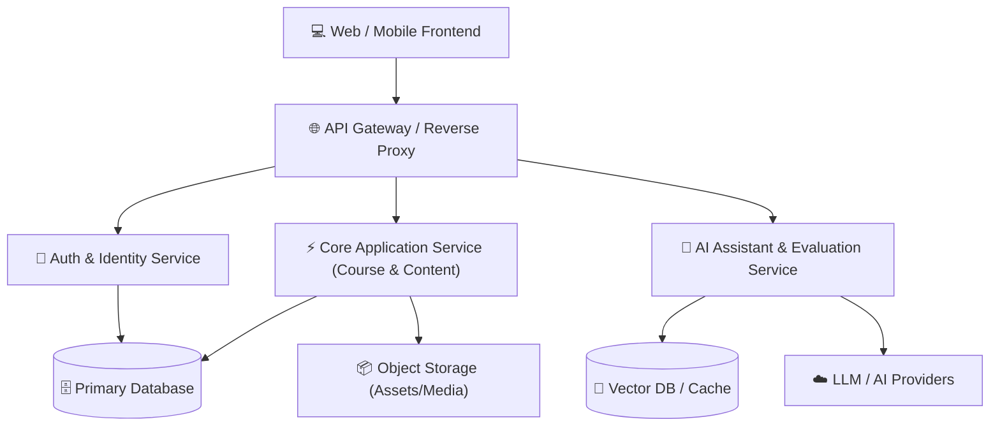

# Architecture & System Design - Dream Academy

> **Status:** Draft / Foundation  
> **Owner:** Architect Agent / Human Founder  
> **Last Updated:** 2026-09-02

---

## 1. High-Level Architecture Overview
Sistem Dream Academy dirancang dengan arsitektur modular, *cloud-native*, dan *API-first* untuk memastikan skalabilitas, kemudahan pengujian, dan integrasi dengan layanan AI.

---

## 2. Tech Stack Recommendations & Guidelines
- **Frontend:** Modern Web Framework (Next.js / React / TypeScript) dengan TailwindCSS.
- **Backend / API:** Node.js (TypeScript) / Python FastAPI / Go.
- **Database:** PostgreSQL (Relational) + Redis (Caching/Sessions).
- **Authentication:** JWT-based auth dengan OAuth2 support.
- **CI/CD:** GitHub Actions untuk automated linting, testing, dan deployment.

---

## 3. Design Principles
1. **Separation of Concerns:** Pemisahan yang jelas antara UI Presentation Layer, Business Logic Layer, dan Data Access Layer.
2. **Stateless API:** Seluruh endpoint API dirancang stateless untuk kemudahan horizontal scaling.
3. **Resilience & Fault Tolerance:** Graceful degradation saat layanan AI pihak ketiga mengalami latensi tinggi atau downtime.
4. **Security by Design:** Validasi input ketat, sanitasi payload, rate limiting, dan role-based access control (RBAC).
