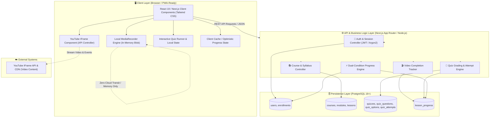
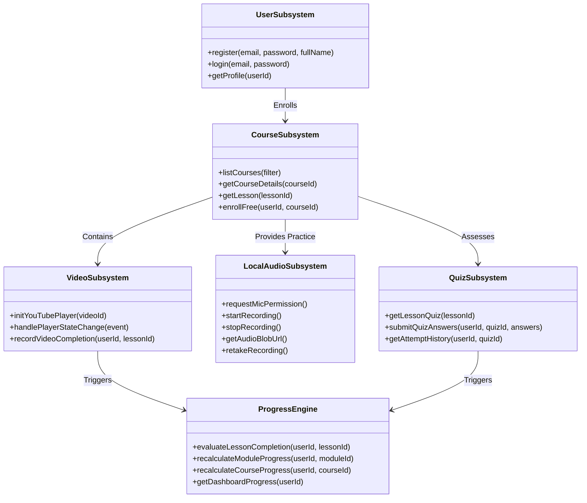
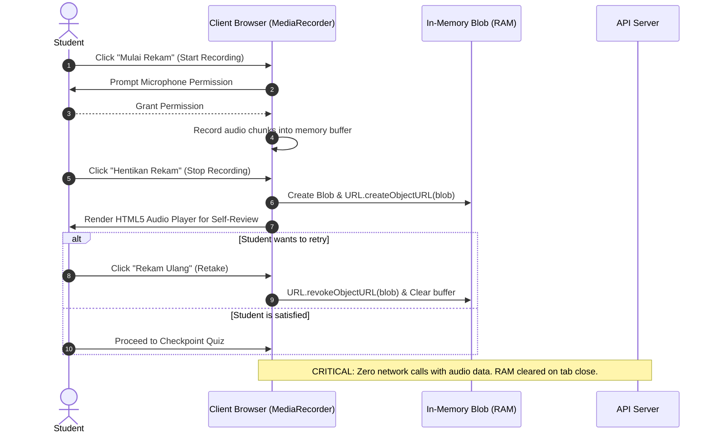
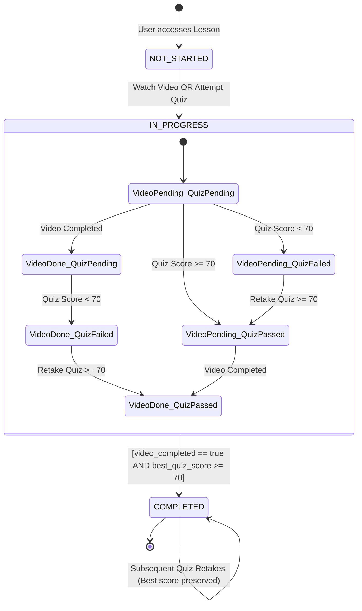

# System Architecture & Technical Specifications — Dream Academy

> **Version:** 1.1 (MVP Architecture Baseline)  
> **Status:** Approved / Ready for Builder Implementation  
> **Author:** Architect Agent  
> **Target Audience:** Builder Agent, QA Agent, Product Agent, Human Founder  
> **Last Updated:** 2026-09-02  
> **Reference Document:** [`docs/PRD.md`](./PRD.md) v1.1 & [`docs/AI_RULES.md`](./AI_RULES.md)

---

## 1. Executive Summary & Architectural Vision

**Dream Academy** is a modern, responsive web application engineered to empower Indonesian English learners to build speaking confidence and fluency. The system architecture balances rapid MVP development velocity with modularity, zero-cloud-audio privacy, and rock-solid state management.

### Key Architectural Pillars
1. **Frictionless Free Navigation:** Fully decoupled content discovery and access; learners can freely traverse courses, modules, and lessons without artificial sequential locks.
2. **Zero Cloud Audio Storage (Local MediaRecorder Architecture):** In-browser ephemeral audio recording via `MediaRecorder` API and memory `Blob` URLs. Audio streams never leave the client's device, ensuring complete privacy and zero backend audio infrastructure overhead.
3. **Curated YouTube Video Integration:** Lightweight, resilient YouTube Embedded Player with reliable completion tracking and graceful fallback mechanisms.
4. **Deterministic Dual-Condition Progress Engine:** Atomic evaluation of lesson completion based on two strict conditions:
   $$\text{Lesson Completed} \iff (\text{video\_completed} = \text{true}) \land (\text{best\_quiz\_score} \ge 70)$$
5. **Unlimited Quiz Retake & Best-Score Evaluation:** Immutable attempt history logging paired with dynamic highest-score aggregation.

---

## 2. High-Level System Architecture

The MVP follows a **Modular Full-Stack Application** pattern (Next.js with TypeScript and PostgreSQL), delivering both the Presentation Layer (SSR/SSG/Client Components) and the API Service Layer.



---

## 3. Recommended Technology Stack

| Layer | Technology | Specification / Rationale |
| :--- | :--- | :--- |
| **Frontend Framework** | **Next.js 14+ / React 19 (App Router)** | Full-stack TypeScript framework enabling fast SSR for catalog/landing and rich Client Components for interactive video, audio, and quiz engines. |
| **Language** | **TypeScript 5.x** | Strict end-to-end type safety shared between API contracts, data models, and UI components. |
| **Styling & Design System** | **Tailwind CSS + Lucide Icons** | Utility-first, responsive, lightweight design system ensuring consistent UI and fast mobile rendering. |
| **Database & ORM** | **PostgreSQL 16+ & Prisma ORM / Drizzle ORM** | ACID-compliant relational storage for nested course hierarchies, progress states, and audit trails. |
| **Authentication & Security** | **JWT (JSON Web Tokens) & Argon2id** | Stateless session management using HttpOnly, Secure, SameSite cookies with Argon2id password hashing. |
| **Audio Engine** | **HTML5 MediaRecorder API** | Native in-browser Web Audio API (`audio/webm;codecs=opus` or fallback `audio/mp4`). |
| **Video Engine** | **YouTube IFrame Player API** | Embed standard `https://www.youtube-nocookie.com/embed/{id}` with postMessage / Player API event bridge. |
| **Validation** | **Zod** | Runtime schema validation for all API inputs, DTOs, and environment variables. |
| **Testing Suite** | **Vitest / Jest + React Testing Library + Playwright** | Unit tests for grading/progress algorithms, component tests for audio/video, and E2E flows. |

---

## 4. Component Boundaries & Subsystem Design



### 4.1. Authentication & User Management Subsystem
- **Responsibilities:** User registration, password encryption, credential verification, JWT issuance, and profile retrieval.
- **Security Boundary:** Passwords hashed with Argon2id (memory cost 64MB, time cost 3, parallelism 1). Tokens stored in HttpOnly cookies to prevent XSS exfiltration.

### 4.2. Course Catalog & Free Navigation Subsystem
- **Responsibilities:** Hierarchical content delivery (`Course` $\rightarrow$ `Module` $\rightarrow$ `Lesson`).
- **Free Navigation Implementation:**
  - Course details endpoint returns the full syllabus tree alongside user progress markers.
  - Lesson route `/courses/[courseSlug]/lessons/[lessonSlug]` allows direct URL routing and sidebar hopping without precondition checks.
  - No database guard prevents a student from reading Lesson $N$ before completing Lesson $1$.

### 4.3. YouTube Video Integration Subsystem
- **Responsibilities:** Embedding responsive video player, monitoring playback progress, and signaling video completion to backend.
- **Player Architecture:**
  1. Component loads YouTube IFrame via official `https://www.youtube.com/iframe_api`.
  2. Embed URL uses privacy-enhanced domain `https://www.youtube-nocookie.com`.
  3. Player tracks playback events (`YT.PlayerState.ENDED` or playback time $\ge 90\%$ of total duration).
  4. On completion, dispatches an idempotent API call: `POST /api/v1/lessons/:id/video-complete`.
- **Fault Tolerance & Fallback Strategy:**
  - If YouTube fails to load (network block, adblocker, video deleted), the UI displays a helpful notice with a fallback summary transcript and allows the student to proceed to speaking practice and quiz without halting the learning journey.

### 4.4. Local Browser Speaking Practice Subsystem (Zero Cloud Audio)
- **Responsibilities:** In-browser audio recording, playback, and retake for speaking drills and shadowing practice.
- **Strict Architecture Constraints:**
  - Zero cloud audio transit: No form-data uploads, no base64 payloads to backend, no S3/GCS buckets.
  - Browser memory lifecycle:
    1. Check `navigator.mediaDevices.getUserMedia({ audio: true })`.
    2. Instantiate `MediaRecorder(stream)`.
    3. Push audio chunks to a client array (`chunks.push(event.data)`).
    4. On stop, create Blob: `const blob = new Blob(chunks, { type: 'audio/webm;codecs=opus' })`.
    5. Generate object URL: `const url = URL.createObjectURL(blob)`.
    6. Mount `url` into HTML5 `<audio controls>` for immediate self-listening.
    7. On "Retake", invoke `URL.revokeObjectURL(url)` to prevent memory leaks and reset recorder state.
- **Microphone Denied Edge Case:**
  - Display non-blocking banner: *"Microphone access required for speaking recording. You can still practice speaking aloud with the transcript and proceed to the quiz."*



### 4.5. Quiz & Unlimited Retake Evaluation Subsystem
- **Responsibilities:** Presenting multiple-choice questions, server-side grading, recording attempts, and determining highest score.
- **Security & Integrity:**
  - Client quiz API (`GET /api/v1/lessons/:id/quiz`) **NEVER** includes `is_correct` boolean or answer keys in the response payload.
  - Answers submitted as `{ answers: [{ question_id: string, selected_option_id: string }] }` to `POST /api/v1/lessons/:id/quiz/submit`.
  - Backend performs deterministic calculation:
    $$\text{Score} = \left( \frac{\text{Number of Correct Answers}}{\text{Total Questions}} \right) \times 100$$
  - $\text{Passed} \iff \text{Score} \ge 70$.
  - Backend records each submission into `quiz_attempts`.
  - Backend aggregates `best_quiz_score = MAX(all attempts for this user and quiz)`.

### 4.6. Deterministic Dual-Condition Progress Engine
- **Responsibilities:** Managing lesson, module, and course completion states.
- **Dual Completion Rule:**
  $$\text{Lesson Status} = \begin{cases} \text{completed}, & \text{if } \text{video\_completed} = \text{true} \land \text{best\_quiz\_score} \ge 70 \\ \text{in\_progress}, & \text{if } \text{video\_completed} = \text{true} \lor \text{best\_quiz\_score} > 0 \\ \text{not\_started}, & \text{otherwise} \end{cases}$$



- **Course & Module Progress Aggregation:**
  $$\text{Module Progress (\%)} = \left( \frac{\sum \text{Completed Lessons in Module}}{\text{Total Lessons in Module}} \right) \times 100$$
  $$\text{Course Progress (\%)} = \left( \frac{\sum \text{Completed Lessons in Course}}{\text{Total Lessons in Course}} \right) \times 100$$

---

## 5. Non-Goals & Scope Boundaries (PRD v1.1 Alignment)

To maintain focus and avoid scope creep during MVP development:
- ❌ **No Payment Gateway Integration:** All courses in MVP are open/free enrollment.
- ❌ **No Cloud Audio Storage:** No audio files sent to backend or saved in object storage.
- ❌ **No AI Speech / Real-Time Pronunciation Evaluation:** MVP focuses on active self-evaluation and shadowing drills without AI scoring overhead.
- ❌ **No Sequential Lesson Locking:** No prerequisite guards on lesson navigation.
- ❌ **No Native Mobile App:** Web application is responsive and mobile-browser optimized (PWA-ready).
- ❌ **No Instructor CMS Portal:** Course content is populated via database seed scripts.

---

## 6. Security, Privacy & Compliance Architecture

1. **Authentication Tokens:**
   - JWT with standard payload (`userId`, `email`, `role`, `exp`, `iat`).
   - Access token lifespan: 15 minutes; Refresh token lifespan: 7 days.
   - Delivered via `HttpOnly`, `SameSite=Lax`, `Secure` cookies.
2. **Password Security:**
   - Password minimum length: 8 characters.
   - Hashed using Argon2id with unique salt.
3. **Data Protection & Zero Audio Leakage:**
   - Client-side checks ensure no multipart form uploads contain audio binary streams.
   - Strict Content Security Policy (CSP) restricting outbound connections.
4. **Input Sanitization & Rate Limiting:**
   - All input bodies validated with Zod schemas.
   - Rate limiting on Auth routes (5 attempts / minute per IP) and Quiz submission (10 attempts / minute per IP).

---

## 7. Error Handling & Resilience Strategy

### 7.1. Standard Error Envelope
All error responses from the backend API adhere to the standardized schema:
```json
{
  "success": false,
  "error": {
    "code": "VALIDATION_ERROR",
    "message": "The submitted payload failed validation.",
    "details": [
      {
        "field": "answers[0].selected_option_id",
        "issue": "Invalid UUID format"
      }
    ],
    "timestamp": "2026-09-02T02:15:00.000Z"
  }
}
```

### 7.2. Client Offline & Network Recovery
- **Quiz Submission:** If a student submits a quiz and the connection drops, answers are saved in `sessionStorage`. An alert banner offers a *"Retry Submission"* button once network connectivity is restored.
- **Video Player Failure:** If YouTube iframe API throws an error code (100, 101, 150), fallback UI renders reading material and unlocks the practice section.

---

## 8. Architectural Sign-Off & Verification

| Role | Responsibility | Status |
| :--- | :--- | :--- |
| **Architect Agent** | Technical Architecture & System Design Specification | ✅ Approved |
| **Builder Agent** | Implementation in accordance with this specification | ⏳ Pending Sprint 1 |
| **QA Agent** | Test automation and AC verification | ⏳ Pending Sprint 1 |
