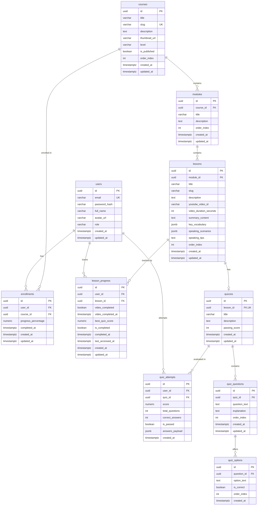

# Database Schema & Data Models — Dream Academy

> **Version:** 1.1 (MVP Database Baseline)  
> **Status:** Approved / Ready for Migration  
> **Author:** Architect Agent  
> **Target Engine:** PostgreSQL 16+  
> **Last Updated:** 2026-09-02  
> **Reference Document:** [`docs/PRD.md`](./PRD.md) v1.1 & [`docs/ARCHITECTURE.md`](./ARCHITECTURE.md)

---

## 1. Schema Overview & Design Principles

The Dream Academy relational schema is designed for PostgreSQL 16+, providing high data integrity, strict referential constraints, optimized indexing for progress aggregation, and audit logging for learning attempts.

### Key Design Tenets
1. **Strong Referential Integrity:** Foreign keys enforce hierarchical cascades (`Course` $\rightarrow$ `Module` $\rightarrow$ `Lesson` $\rightarrow$ `Quiz` $\rightarrow$ `Question` $\rightarrow$ `Option`).
2. **Deterministic Dual-Condition Progress:** `lesson_progress` table maintains explicit tracking flags (`video_completed`, `best_quiz_score`, `is_completed`) with atomic recalculation triggers.
3. **Immutable Quiz Attempt Logging:** Every student attempt is preserved in `quiz_attempts` with full JSON payload snapshots, supporting unlimited retakes while deriving the best score.
4. **Optimized Indexes:** Composite indexes on `(user_id, lesson_id)`, `(user_id, course_id)`, and `(quiz_id, user_id)` ensure sub-millisecond progress lookups and dashboard queries.

---

## 2. Entity Relationship Diagram (ERD)



---

## 3. Detailed Data Dictionary

### 3.1. `users`
Represents registered students and system administrators.

| Column | Type | Constraints | Description |
| :--- | :--- | :--- | :--- |
| `id` | `UUID` | `PRIMARY KEY, DEFAULT gen_random_uuid()` | Unique user identifier |
| `email` | `VARCHAR(255)` | `NOT NULL, UNIQUE` | User email address (case-insensitive indexed) |
| `password_hash` | `VARCHAR(255)` | `NOT NULL` | Argon2id/Bcrypt encrypted password hash |
| `full_name` | `VARCHAR(150)` | `NOT NULL` | Full display name of the user |
| `avatar_url` | `VARCHAR(500)` | `NULL` | Optional avatar image URL |
| `role` | `VARCHAR(20)` | `NOT NULL, DEFAULT 'student'` | User role: `'student'`, `'admin'` |
| `created_at` | `TIMESTAMPTZ` | `NOT NULL, DEFAULT NOW()` | Record creation timestamp |
| `updated_at` | `TIMESTAMPTZ` | `NOT NULL, DEFAULT NOW()` | Record last update timestamp |

### 3.2. `courses`
Represents learning courses available on Dream Academy.

| Column | Type | Constraints | Description |
| :--- | :--- | :--- | :--- |
| `id` | `UUID` | `PRIMARY KEY, DEFAULT gen_random_uuid()` | Unique course identifier |
| `title` | `VARCHAR(255)` | `NOT NULL` | Course title |
| `slug` | `VARCHAR(255)` | `NOT NULL, UNIQUE` | URL-friendly unique slug (e.g. `speaking-confidence-mastery`) |
| `description` | `TEXT` | `NOT NULL` | Detailed course overview and learning objectives |
| `thumbnail_url` | `VARCHAR(500)` | `NULL` | Cover thumbnail image URL |
| `level` | `VARCHAR(50)` | `NOT NULL, DEFAULT 'beginner'` | Difficulty level: `'beginner'`, `'intermediate'`, `'advanced'` |
| `is_published` | `BOOLEAN` | `NOT NULL, DEFAULT true` | Publication visibility flag |
| `order_index` | `INT` | `NOT NULL, DEFAULT 0` | Display ordering index |
| `created_at` | `TIMESTAMPTZ` | `NOT NULL, DEFAULT NOW()` | Record creation timestamp |
| `updated_at` | `TIMESTAMPTZ` | `NOT NULL, DEFAULT NOW()` | Record last update timestamp |

### 3.3. `modules`
Represents thematic learning units within a course.

| Column | Type | Constraints | Description |
| :--- | :--- | :--- | :--- |
| `id` | `UUID` | `PRIMARY KEY, DEFAULT gen_random_uuid()` | Unique module identifier |
| `course_id` | `UUID` | `NOT NULL, FK -> courses(id) ON DELETE CASCADE` | Parent course reference |
| `title` | `VARCHAR(255)` | `NOT NULL` | Module title (e.g. `Overcoming Fear & Small Talk`) |
| `description` | `TEXT` | `NULL` | Module description and goals |
| `order_index` | `INT` | `NOT NULL, DEFAULT 0` | Ordering within the parent course |
| `created_at` | `TIMESTAMPTZ` | `NOT NULL, DEFAULT NOW()` | Record creation timestamp |
| `updated_at` | `TIMESTAMPTZ` | `NOT NULL, DEFAULT NOW()` | Record last update timestamp |

### 3.4. `lessons`
Represents individual lesson units featuring YouTube video, speaking practice drills, and checkpoint quiz.

| Column | Type | Constraints | Description |
| :--- | :--- | :--- | :--- |
| `id` | `UUID` | `PRIMARY KEY, DEFAULT gen_random_uuid()` | Unique lesson identifier |
| `module_id` | `UUID` | `NOT NULL, FK -> modules(id) ON DELETE CASCADE` | Parent module reference |
| `title` | `VARCHAR(255)` | `NOT NULL` | Lesson title (e.g. `Self-Introduction Without Fear`) |
| `slug` | `VARCHAR(255)` | `NOT NULL` | URL-friendly slug within module scope |
| `description` | `TEXT` | `NULL` | Lesson brief |
| `youtube_video_id` | `VARCHAR(50)` | `NOT NULL` | YouTube Video ID (e.g. `dQw4w9WgXcQ`) |
| `video_duration_seconds` | `INT` | `NOT NULL, DEFAULT 0` | Video duration in seconds |
| `summary_content` | `TEXT` | `NOT NULL` | Markdown summary of lesson takeaways |
| `key_vocabulary` | `JSONB` | `NOT NULL, DEFAULT '[]'` | Array of vocabulary objects: `[{"term": "...", "phonetic": "...", "definition": "...", "example": "..."}]` |
| `speaking_scenarios` | `JSONB` | `NOT NULL, DEFAULT '[]'` | Array of practice drills: `[{"role": "...", "prompt": "...", "shadowing_text": "..."}]` |
| `speaking_tips` | `TEXT` | `NULL` | Mindset & confidence tips for speaking |
| `order_index` | `INT` | `NOT NULL, DEFAULT 0` | Ordering within the module |
| `created_at` | `TIMESTAMPTZ` | `NOT NULL, DEFAULT NOW()` | Record creation timestamp |
| `updated_at` | `TIMESTAMPTZ` | `NOT NULL, DEFAULT NOW()` | Record last update timestamp |

### 3.5. `enrollments`
Tracks student course registrations and overall progress percentages.

| Column | Type | Constraints | Description |
| :--- | :--- | :--- | :--- |
| `id` | `UUID` | `PRIMARY KEY, DEFAULT gen_random_uuid()` | Unique enrollment identifier |
| `user_id` | `UUID` | `NOT NULL, FK -> users(id) ON DELETE CASCADE` | Enrolled user |
| `course_id` | `UUID` | `NOT NULL, FK -> courses(id) ON DELETE CASCADE` | Enrolled course |
| `progress_percentage` | `NUMERIC(5,2)` | `NOT NULL, DEFAULT 0.00` | Course completion percentage (0.00 to 100.00) |
| `completed_at` | `TIMESTAMPTZ` | `NULL` | Timestamp when course reached 100% |
| `created_at` | `TIMESTAMPTZ` | `NOT NULL, DEFAULT NOW()` | Record creation timestamp |
| `updated_at` | `TIMESTAMPTZ` | `NOT NULL, DEFAULT NOW()` | Record last update timestamp |

*Constraint:* `UNIQUE(user_id, course_id)`

### 3.6. `lesson_progress`
Maintains the student's granular progress per lesson.

| Column | Type | Constraints | Description |
| :--- | :--- | :--- | :--- |
| `id` | `UUID` | `PRIMARY KEY, DEFAULT gen_random_uuid()` | Unique progress record ID |
| `user_id` | `UUID` | `NOT NULL, FK -> users(id) ON DELETE CASCADE` | Student user |
| `lesson_id` | `UUID` | `NOT NULL, FK -> lessons(id) ON DELETE CASCADE` | Tracked lesson |
| `video_completed` | `BOOLEAN` | `NOT NULL, DEFAULT false` | Video watch completion trigger |
| `video_completed_at` | `TIMESTAMPTZ` | `NULL` | Timestamp when video was completed |
| `best_quiz_score` | `NUMERIC(5,2)` | `NOT NULL, DEFAULT 0.00` | Highest score attained across all attempts (0–100) |
| `is_completed` | `BOOLEAN` | `NOT NULL, DEFAULT false` | `true` only if `video_completed = true` AND `best_quiz_score >= 70.00` |
| `completed_at` | `TIMESTAMPTZ` | `NULL` | Timestamp when dual condition was first met |
| `last_accessed_at` | `TIMESTAMPTZ` | `NOT NULL, DEFAULT NOW()` | Last interaction timestamp (for Resume Learning) |
| `created_at` | `TIMESTAMPTZ` | `NOT NULL, DEFAULT NOW()` | Record creation timestamp |
| `updated_at` | `TIMESTAMPTZ` | `NOT NULL, DEFAULT NOW()` | Record last update timestamp |

*Constraint:* `UNIQUE(user_id, lesson_id)`

### 3.7. `quizzes`
Represents the checkpoint quiz attached to a lesson.

| Column | Type | Constraints | Description |
| :--- | :--- | :--- | :--- |
| `id` | `UUID` | `PRIMARY KEY, DEFAULT gen_random_uuid()` | Unique quiz identifier |
| `lesson_id` | `UUID` | `NOT NULL, UNIQUE, FK -> lessons(id) ON DELETE CASCADE` | 1-to-1 association with lesson |
| `title` | `VARCHAR(255)` | `NOT NULL` | Quiz title |
| `description` | `TEXT` | `NULL` | Quiz instructions |
| `passing_score` | `INT` | `NOT NULL, DEFAULT 70` | Passing threshold (PRD: 70) |
| `created_at` | `TIMESTAMPTZ` | `NOT NULL, DEFAULT NOW()` | Record creation timestamp |
| `updated_at` | `TIMESTAMPTZ` | `NOT NULL, DEFAULT NOW()` | Record last update timestamp |

### 3.8. `quiz_questions`
Represents individual multiple-choice questions within a quiz.

| Column | Type | Constraints | Description |
| :--- | :--- | :--- | :--- |
| `id` | `UUID` | `PRIMARY KEY, DEFAULT gen_random_uuid()` | Unique question identifier |
| `quiz_id` | `UUID` | `NOT NULL, FK -> quizzes(id) ON DELETE CASCADE` | Parent quiz |
| `question_text` | `TEXT` | `NOT NULL` | Question statement |
| `explanation` | `TEXT` | `NULL` | Pedagogical explanation revealed after grading |
| `order_index` | `INT` | `NOT NULL, DEFAULT 0` | Display order in quiz |
| `created_at` | `TIMESTAMPTZ` | `NOT NULL, DEFAULT NOW()` | Record creation timestamp |
| `updated_at` | `TIMESTAMPTZ` | `NOT NULL, DEFAULT NOW()` | Record last update timestamp |

### 3.9. `quiz_options`
Represents answer choices for each question.

| Column | Type | Constraints | Description |
| :--- | :--- | :--- | :--- |
| `id` | `UUID` | `PRIMARY KEY, DEFAULT gen_random_uuid()` | Unique option identifier |
| `question_id` | `UUID` | `NOT NULL, FK -> quiz_questions(id) ON DELETE CASCADE` | Parent question |
| `option_text` | `TEXT` | `NOT NULL` | Choice text displayed to student |
| `is_correct` | `BOOLEAN` | `NOT NULL, DEFAULT false` | Correctness flag (kept secret on backend) |
| `order_index` | `INT` | `NOT NULL, DEFAULT 0` | Display order |
| `created_at` | `TIMESTAMPTZ` | `NOT NULL, DEFAULT NOW()` | Record creation timestamp |

### 3.10. `quiz_attempts`
Logs every quiz submission for historical tracking and best-score calculation.

| Column | Type | Constraints | Description |
| :--- | :--- | :--- | :--- |
| `id` | `UUID` | `PRIMARY KEY, DEFAULT gen_random_uuid()` | Unique attempt identifier |
| `user_id` | `UUID` | `NOT NULL, FK -> users(id) ON DELETE CASCADE` | Student user |
| `quiz_id` | `UUID` | `NOT NULL, FK -> quizzes(id) ON DELETE CASCADE` | Evaluated quiz |
| `score` | `NUMERIC(5,2)` | `NOT NULL` | Attained score in percentage (0.00 to 100.00) |
| `total_questions` | `INT` | `NOT NULL` | Total number of questions graded |
| `correct_answers` | `INT` | `NOT NULL` | Number of correct answers |
| `is_passed` | `BOOLEAN` | `NOT NULL` | `true` if `score >= passing_score` |
| `answers_payload` | `JSONB` | `NOT NULL` | Detailed answer snapshot: `[{"question_id": "...", "selected_option_id": "...", "is_correct": true}]` |
| `created_at` | `TIMESTAMPTZ` | `NOT NULL, DEFAULT NOW()` | Attempt submission timestamp |

---

## 4. Complete PostgreSQL DDL Script

```sql
-- Dream Academy PostgreSQL 16+ Schema Definition
-- Run within migration script

CREATE EXTENSION IF NOT EXISTS "pgcrypto";

-- 1. Users Table
CREATE TABLE users (
    id UUID PRIMARY KEY DEFAULT gen_random_uuid(),
    email VARCHAR(255) NOT NULL UNIQUE,
    password_hash VARCHAR(255) NOT NULL,
    full_name VARCHAR(150) NOT NULL,
    avatar_url VARCHAR(500) NULL,
    role VARCHAR(20) NOT NULL DEFAULT 'student' CHECK (role IN ('student', 'admin')),
    created_at TIMESTAMPTZ NOT NULL DEFAULT NOW(),
    updated_at TIMESTAMPTZ NOT NULL DEFAULT NOW()
);

CREATE INDEX idx_users_email ON users(email);

-- 2. Courses Table
CREATE TABLE courses (
    id UUID PRIMARY KEY DEFAULT gen_random_uuid(),
    title VARCHAR(255) NOT NULL,
    slug VARCHAR(255) NOT NULL UNIQUE,
    description TEXT NOT NULL,
    thumbnail_url VARCHAR(500) NULL,
    level VARCHAR(50) NOT NULL DEFAULT 'beginner' CHECK (level IN ('beginner', 'intermediate', 'advanced')),
    is_published BOOLEAN NOT NULL DEFAULT true,
    order_index INT NOT NULL DEFAULT 0,
    created_at TIMESTAMPTZ NOT NULL DEFAULT NOW(),
    updated_at TIMESTAMPTZ NOT NULL DEFAULT NOW()
);

CREATE INDEX idx_courses_slug ON courses(slug);
CREATE INDEX idx_courses_published_order ON courses(is_published, order_index);

-- 3. Modules Table
CREATE TABLE modules (
    id UUID PRIMARY KEY DEFAULT gen_random_uuid(),
    course_id UUID NOT NULL REFERENCES courses(id) ON DELETE CASCADE,
    title VARCHAR(255) NOT NULL,
    description TEXT NULL,
    order_index INT NOT NULL DEFAULT 0,
    created_at TIMESTAMPTZ NOT NULL DEFAULT NOW(),
    updated_at TIMESTAMPTZ NOT NULL DEFAULT NOW()
);

CREATE INDEX idx_modules_course_order ON modules(course_id, order_index);

-- 4. Lessons Table
CREATE TABLE lessons (
    id UUID PRIMARY KEY DEFAULT gen_random_uuid(),
    module_id UUID NOT NULL REFERENCES modules(id) ON DELETE CASCADE,
    title VARCHAR(255) NOT NULL,
    slug VARCHAR(255) NOT NULL,
    description TEXT NULL,
    youtube_video_id VARCHAR(50) NOT NULL,
    video_duration_seconds INT NOT NULL DEFAULT 0,
    summary_content TEXT NOT NULL,
    key_vocabulary JSONB NOT NULL DEFAULT '[]'::jsonb,
    speaking_scenarios JSONB NOT NULL DEFAULT '[]'::jsonb,
    speaking_tips TEXT NULL,
    order_index INT NOT NULL DEFAULT 0,
    created_at TIMESTAMPTZ NOT NULL DEFAULT NOW(),
    updated_at TIMESTAMPTZ NOT NULL DEFAULT NOW(),
    CONSTRAINT uq_module_lesson_slug UNIQUE (module_id, slug)
);

CREATE INDEX idx_lessons_module_order ON lessons(module_id, order_index);

-- 5. Enrollments Table
CREATE TABLE enrollments (
    id UUID PRIMARY KEY DEFAULT gen_random_uuid(),
    user_id UUID NOT NULL REFERENCES users(id) ON DELETE CASCADE,
    course_id UUID NOT NULL REFERENCES courses(id) ON DELETE CASCADE,
    progress_percentage NUMERIC(5,2) NOT NULL DEFAULT 0.00 CHECK (progress_percentage >= 0.00 AND progress_percentage <= 100.00),
    completed_at TIMESTAMPTZ NULL,
    created_at TIMESTAMPTZ NOT NULL DEFAULT NOW(),
    updated_at TIMESTAMPTZ NOT NULL DEFAULT NOW(),
    CONSTRAINT uq_user_course_enrollment UNIQUE (user_id, course_id)
);

CREATE INDEX idx_enrollments_user_course ON enrollments(user_id, course_id);

-- 6. Quizzes Table
CREATE TABLE quizzes (
    id UUID PRIMARY KEY DEFAULT gen_random_uuid(),
    lesson_id UUID NOT NULL UNIQUE REFERENCES lessons(id) ON DELETE CASCADE,
    title VARCHAR(255) NOT NULL,
    description TEXT NULL,
    passing_score INT NOT NULL DEFAULT 70 CHECK (passing_score >= 0 AND passing_score <= 100),
    created_at TIMESTAMPTZ NOT NULL DEFAULT NOW(),
    updated_at TIMESTAMPTZ NOT NULL DEFAULT NOW()
);

CREATE INDEX idx_quizzes_lesson_id ON quizzes(lesson_id);

-- 7. Quiz Questions Table
CREATE TABLE quiz_questions (
    id UUID PRIMARY KEY DEFAULT gen_random_uuid(),
    quiz_id UUID NOT NULL REFERENCES quizzes(id) ON DELETE CASCADE,
    question_text TEXT NOT NULL,
    explanation TEXT NULL,
    order_index INT NOT NULL DEFAULT 0,
    created_at TIMESTAMPTZ NOT NULL DEFAULT NOW(),
    updated_at TIMESTAMPTZ NOT NULL DEFAULT NOW()
);

CREATE INDEX idx_quiz_questions_quiz_order ON quiz_questions(quiz_id, order_index);

-- 8. Quiz Options Table
CREATE TABLE quiz_options (
    id UUID PRIMARY KEY DEFAULT gen_random_uuid(),
    question_id UUID NOT NULL REFERENCES quiz_questions(id) ON DELETE CASCADE,
    option_text TEXT NOT NULL,
    is_correct BOOLEAN NOT NULL DEFAULT false,
    order_index INT NOT NULL DEFAULT 0,
    created_at TIMESTAMPTZ NOT NULL DEFAULT NOW()
);

CREATE INDEX idx_quiz_options_question_order ON quiz_options(question_id, order_index);

-- 9. Quiz Attempts Table
CREATE TABLE quiz_attempts (
    id UUID PRIMARY KEY DEFAULT gen_random_uuid(),
    user_id UUID NOT NULL REFERENCES users(id) ON DELETE CASCADE,
    quiz_id UUID NOT NULL REFERENCES quizzes(id) ON DELETE CASCADE,
    score NUMERIC(5,2) NOT NULL CHECK (score >= 0.00 AND score <= 100.00),
    total_questions INT NOT NULL CHECK (total_questions > 0),
    correct_answers INT NOT NULL CHECK (correct_answers >= 0),
    is_passed BOOLEAN NOT NULL DEFAULT false,
    answers_payload JSONB NOT NULL DEFAULT '[]'::jsonb,
    created_at TIMESTAMPTZ NOT NULL DEFAULT NOW()
);

CREATE INDEX idx_quiz_attempts_user_quiz ON quiz_attempts(user_id, quiz_id, created_at DESC);
CREATE INDEX idx_quiz_attempts_best_score ON quiz_attempts(user_id, quiz_id, score DESC);

-- 10. Lesson Progress Table
CREATE TABLE lesson_progress (
    id UUID PRIMARY KEY DEFAULT gen_random_uuid(),
    user_id UUID NOT NULL REFERENCES users(id) ON DELETE CASCADE,
    lesson_id UUID NOT NULL REFERENCES lessons(id) ON DELETE CASCADE,
    video_completed BOOLEAN NOT NULL DEFAULT false,
    video_completed_at TIMESTAMPTZ NULL,
    best_quiz_score NUMERIC(5,2) NOT NULL DEFAULT 0.00 CHECK (best_quiz_score >= 0.00 AND best_quiz_score <= 100.00),
    is_completed BOOLEAN NOT NULL DEFAULT false,
    completed_at TIMESTAMPTZ NULL,
    last_accessed_at TIMESTAMPTZ NOT NULL DEFAULT NOW(),
    created_at TIMESTAMPTZ NOT NULL DEFAULT NOW(),
    updated_at TIMESTAMPTZ NOT NULL DEFAULT NOW(),
    CONSTRAINT uq_user_lesson_progress UNIQUE (user_id, lesson_id)
);

CREATE INDEX idx_lesson_progress_user_lesson ON lesson_progress(user_id, lesson_id);
CREATE INDEX idx_lesson_progress_user_completed ON lesson_progress(user_id, is_completed);

-- Universal updated_at Trigger Function
CREATE OR REPLACE FUNCTION trigger_set_timestamp()
RETURNS TRIGGER AS $$
BEGIN
  NEW.updated_at = NOW();
  RETURN NEW;
END;
$$ LANGUAGE plpgsql;

-- Attach updated_at triggers
CREATE TRIGGER set_timestamp_users BEFORE UPDATE ON users FOR EACH ROW EXECUTE FUNCTION trigger_set_timestamp();
CREATE TRIGGER set_timestamp_courses BEFORE UPDATE ON courses FOR EACH ROW EXECUTE FUNCTION trigger_set_timestamp();
CREATE TRIGGER set_timestamp_modules BEFORE UPDATE ON modules FOR EACH ROW EXECUTE FUNCTION trigger_set_timestamp();
CREATE TRIGGER set_timestamp_lessons BEFORE UPDATE ON lessons FOR EACH ROW EXECUTE FUNCTION trigger_set_timestamp();
CREATE TRIGGER set_timestamp_enrollments BEFORE UPDATE ON enrollments FOR EACH ROW EXECUTE FUNCTION trigger_set_timestamp();
CREATE TRIGGER set_timestamp_quizzes BEFORE UPDATE ON quizzes FOR EACH ROW EXECUTE FUNCTION trigger_set_timestamp();
CREATE TRIGGER set_timestamp_quiz_questions BEFORE UPDATE ON quiz_questions FOR EACH ROW EXECUTE FUNCTION trigger_set_timestamp();
CREATE TRIGGER set_timestamp_lesson_progress BEFORE UPDATE ON lesson_progress FOR EACH ROW EXECUTE FUNCTION trigger_set_timestamp();
```

---

## 5. Key SQL Queries & Transaction Patterns

### 5.1. Best Quiz Score Aggregation
Calculates the highest score achieved by a user on a given quiz:
```sql
SELECT COALESCE(MAX(score), 0.00) AS best_score
FROM quiz_attempts
WHERE user_id = $1 AND quiz_id = $2;
```

### 5.2. Atomic Dual-Condition Progress Upsert
Executes whenever a video is marked completed or a quiz attempt is submitted:
```sql
INSERT INTO lesson_progress (
    user_id,
    lesson_id,
    video_completed,
    video_completed_at,
    best_quiz_score,
    is_completed,
    completed_at,
    last_accessed_at
)
VALUES (
    $1, -- user_id
    $2, -- lesson_id
    $3, -- video_completed
    CASE WHEN $3 = true THEN NOW() ELSE NULL END,
    $4, -- best_quiz_score
    ($3 = true AND $4 >= 70.00), -- is_completed dual condition
    CASE WHEN ($3 = true AND $4 >= 70.00) THEN NOW() ELSE NULL END,
    NOW()
)
ON CONFLICT (user_id, lesson_id) DO UPDATE
SET 
    video_completed = EXCLUDED.video_completed OR lesson_progress.video_completed,
    video_completed_at = COALESCE(lesson_progress.video_completed_at, EXCLUDED.video_completed_at),
    best_quiz_score = GREATEST(lesson_progress.best_quiz_score, EXCLUDED.best_quiz_score),
    is_completed = (
        (EXCLUDED.video_completed OR lesson_progress.video_completed) = true 
        AND GREATEST(lesson_progress.best_quiz_score, EXCLUDED.best_quiz_score) >= 70.00
    ),
    completed_at = CASE 
        WHEN (
            (EXCLUDED.video_completed OR lesson_progress.video_completed) = true 
            AND GREATEST(lesson_progress.best_quiz_score, EXCLUDED.best_quiz_score) >= 70.00
            AND lesson_progress.is_completed = false
        ) THEN NOW()
        ELSE lesson_progress.completed_at
    END,
    last_accessed_at = NOW(),
    updated_at = NOW()
RETURNING *;
```

### 5.3. Course Enrollment Progress Recalculation
Recalculates the course progress percentage based on total completed lessons:
```sql
WITH course_stats AS (
    SELECT 
        m.course_id,
        COUNT(l.id) AS total_lessons,
        COUNT(CASE WHEN lp.is_completed = true THEN 1 END) AS completed_lessons
    FROM modules m
    JOIN lessons l ON l.module_id = m.id
    LEFT JOIN lesson_progress lp ON lp.lesson_id = l.id AND lp.user_id = $1
    WHERE m.course_id = $2
    GROUP BY m.course_id
)
UPDATE enrollments
SET 
    progress_percentage = CASE 
        WHEN cs.total_lessons = 0 THEN 0.00
        ELSE ROUND((cs.completed_lessons::numeric / cs.total_lessons) * 100, 2)
    END,
    completed_at = CASE 
        WHEN cs.total_lessons > 0 AND cs.completed_lessons = cs.total_lessons THEN NOW()
        ELSE NULL
    END,
    updated_at = NOW()
FROM course_stats cs
WHERE enrollments.user_id = $1 AND enrollments.course_id = $2
RETURNING enrollments.progress_percentage, enrollments.completed_at;
```

### 5.4. Student Dashboard Summary Query
Retrieves enrolled courses with active progress and last accessed lesson for the *"Continue Learning"* shortcut:
```sql
SELECT 
    c.id AS course_id,
    c.title AS course_title,
    c.slug AS course_slug,
    c.thumbnail_url,
    c.level,
    e.progress_percentage,
    e.created_at AS enrolled_at,
    last_lesson.id AS resume_lesson_id,
    last_lesson.title AS resume_lesson_title,
    last_lesson.slug AS resume_lesson_slug,
    last_module.title AS resume_module_title
FROM enrollments e
JOIN courses c ON c.id = e.course_id
LEFT JOIN LATERAL (
    SELECT l.id, l.title, l.slug, l.module_id, lp.last_accessed_at
    FROM lesson_progress lp
    JOIN lessons l ON l.id = lp.lesson_id
    JOIN modules m ON m.id = l.module_id
    WHERE lp.user_id = e.user_id AND m.course_id = c.id
    ORDER BY lp.last_accessed_at DESC
    LIMIT 1
) last_lesson ON true
LEFT JOIN modules last_module ON last_module.id = last_lesson.module_id
WHERE e.user_id = $1 AND c.is_published = true
ORDER BY e.updated_at DESC;
```
