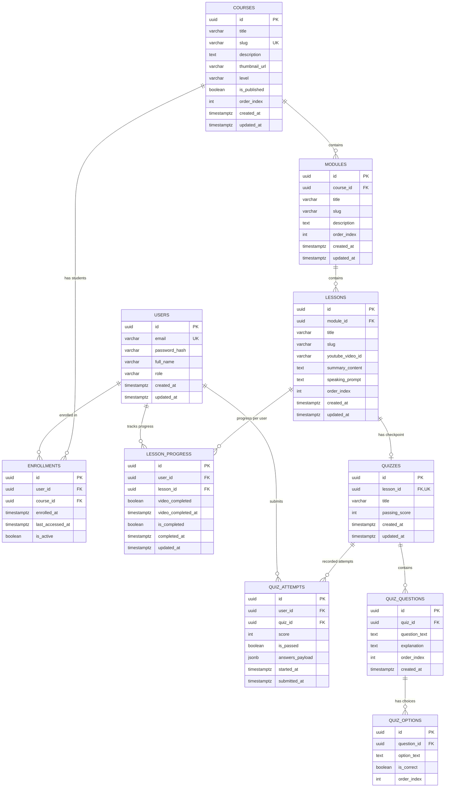

# Database Schema & Data Models — Dream Academy

> **Version:** 1.0 (MVP PostgreSQL Relational Specification)  
> **Status:** APPROVED / Source of Truth for Builder Agent  
> **Author:** Architect Agent / Technical Lead  
> **Target Engine:** PostgreSQL 16+  
> **Last Updated:** 2026-09-02

---

## 1. Engine, Conventions & Design Guidelines

- **RDBMS Engine:** PostgreSQL 16+
- **Naming Conventions:**
  - Nama tabel: `snake_case`, jamak/plural (misal: `users`, `courses`, `quiz_attempts`).
  - Nama kolom: `snake_case`, tunggal/singular (misal: `created_at`, `lesson_id`, `is_completed`).
  - Primary Key: Kolom `id` bertipe `UUID` dengan default value `gen_random_uuid()` (standar PostgreSQL v13+).
  - Foreign Key: `<singular_table_name>_id` bertipe `UUID` yang mereferensikan `id` pada tabel induk.
  - Timestamps: Seluruh tabel transaksional wajib memuat `created_at TIMESTAMPTZ DEFAULT NOW()` dan `updated_at TIMESTAMPTZ DEFAULT NOW()`.
- **Integritas Relasional:**
  - Seluruh relasi child-to-parent dikonfigurasi dengan `ON DELETE CASCADE` untuk data silabus dan kuis (kecuali penghapusan pengguna yang menggunakan soft deletion / restrict jika memiliki riwayat penting).

---

## 2. Entity Relationship Diagram (ERD)



---

## 3. Concrete SQL Table Definitions & DDL

```sql
-- Enable UUID extension
CREATE EXTENSION IF NOT EXISTS "pgcrypto";

-- 1. USERS TABLE
CREATE TABLE users (
    id UUID PRIMARY KEY DEFAULT gen_random_uuid(),
    email VARCHAR(255) NOT NULL UNIQUE,
    password_hash VARCHAR(255) NOT NULL,
    full_name VARCHAR(150) NOT NULL,
    role VARCHAR(50) NOT NULL DEFAULT 'student' CHECK (role IN ('student', 'admin')),
    created_at TIMESTAMPTZ NOT NULL DEFAULT NOW(),
    updated_at TIMESTAMPTZ NOT NULL DEFAULT NOW()
);

-- 2. COURSES TABLE
CREATE TABLE courses (
    id UUID PRIMARY KEY DEFAULT gen_random_uuid(),
    title VARCHAR(255) NOT NULL,
    slug VARCHAR(255) NOT NULL UNIQUE,
    description TEXT,
    thumbnail_url VARCHAR(500),
    level VARCHAR(50) NOT NULL DEFAULT 'beginner' CHECK (level IN ('beginner', 'intermediate', 'advanced')),
    is_published BOOLEAN NOT NULL DEFAULT TRUE,
    order_index INT NOT NULL DEFAULT 0,
    created_at TIMESTAMPTZ NOT NULL DEFAULT NOW(),
    updated_at TIMESTAMPTZ NOT NULL DEFAULT NOW()
);

-- 3. MODULES TABLE
CREATE TABLE modules (
    id UUID PRIMARY KEY DEFAULT gen_random_uuid(),
    course_id UUID NOT NULL REFERENCES courses(id) ON DELETE CASCADE,
    title VARCHAR(255) NOT NULL,
    slug VARCHAR(255) NOT NULL,
    description TEXT,
    order_index INT NOT NULL DEFAULT 0,
    created_at TIMESTAMPTZ NOT NULL DEFAULT NOW(),
    updated_at TIMESTAMPTZ NOT NULL DEFAULT NOW(),
    CONSTRAINT uq_module_course_slug UNIQUE (course_id, slug)
);

-- 4. LESSONS TABLE
CREATE TABLE lessons (
    id UUID PRIMARY KEY DEFAULT gen_random_uuid(),
    module_id UUID NOT NULL REFERENCES modules(id) ON DELETE CASCADE,
    title VARCHAR(255) NOT NULL,
    slug VARCHAR(255) NOT NULL,
    youtube_video_id VARCHAR(50) NOT NULL,
    summary_content TEXT,
    speaking_prompt TEXT,
    order_index INT NOT NULL DEFAULT 0,
    created_at TIMESTAMPTZ NOT NULL DEFAULT NOW(),
    updated_at TIMESTAMPTZ NOT NULL DEFAULT NOW(),
    CONSTRAINT uq_lesson_module_slug UNIQUE (module_id, slug)
);

-- 5. ENROLLMENTS TABLE (Free Access / Enrollment Tracking)
CREATE TABLE enrollments (
    id UUID PRIMARY KEY DEFAULT gen_random_uuid(),
    user_id UUID NOT NULL REFERENCES users(id) ON DELETE CASCADE,
    course_id UUID NOT NULL REFERENCES courses(id) ON DELETE CASCADE,
    enrolled_at TIMESTAMPTZ NOT NULL DEFAULT NOW(),
    last_accessed_at TIMESTAMPTZ NOT NULL DEFAULT NOW(),
    is_active BOOLEAN NOT NULL DEFAULT TRUE,
    CONSTRAINT uq_user_course_enrollment UNIQUE (user_id, course_id)
);

-- 6. LESSON_PROGRESS TABLE (Dual-Trigger State)
CREATE TABLE lesson_progress (
    id UUID PRIMARY KEY DEFAULT gen_random_uuid(),
    user_id UUID NOT NULL REFERENCES users(id) ON DELETE CASCADE,
    lesson_id UUID NOT NULL REFERENCES lessons(id) ON DELETE CASCADE,
    video_completed BOOLEAN NOT NULL DEFAULT FALSE,
    video_completed_at TIMESTAMPTZ,
    is_completed BOOLEAN NOT NULL DEFAULT FALSE,
    completed_at TIMESTAMPTZ,
    updated_at TIMESTAMPTZ NOT NULL DEFAULT NOW(),
    CONSTRAINT uq_user_lesson_progress UNIQUE (user_id, lesson_id)
);

-- 7. QUIZZES TABLE
CREATE TABLE quizzes (
    id UUID PRIMARY KEY DEFAULT gen_random_uuid(),
    lesson_id UUID NOT NULL UNIQUE REFERENCES lessons(id) ON DELETE CASCADE,
    title VARCHAR(255) NOT NULL,
    passing_score INT NOT NULL DEFAULT 70,
    created_at TIMESTAMPTZ NOT NULL DEFAULT NOW(),
    updated_at TIMESTAMPTZ NOT NULL DEFAULT NOW()
);

-- 8. QUIZ_QUESTIONS TABLE
CREATE TABLE quiz_questions (
    id UUID PRIMARY KEY DEFAULT gen_random_uuid(),
    quiz_id UUID NOT NULL REFERENCES quizzes(id) ON DELETE CASCADE,
    question_text TEXT NOT NULL,
    explanation TEXT,
    order_index INT NOT NULL DEFAULT 0,
    created_at TIMESTAMPTZ NOT NULL DEFAULT NOW()
);

-- 9. QUIZ_OPTIONS TABLE
CREATE TABLE quiz_options (
    id UUID PRIMARY KEY DEFAULT gen_random_uuid(),
    question_id UUID NOT NULL REFERENCES quiz_questions(id) ON DELETE CASCADE,
    option_text TEXT NOT NULL,
    is_correct BOOLEAN NOT NULL DEFAULT FALSE,
    order_index INT NOT NULL DEFAULT 0
);

-- 10. QUIZ_ATTEMPTS TABLE (Unlimited Retake Logs)
CREATE TABLE quiz_attempts (
    id UUID PRIMARY KEY DEFAULT gen_random_uuid(),
    user_id UUID NOT NULL REFERENCES users(id) ON DELETE CASCADE,
    quiz_id UUID NOT NULL REFERENCES quizzes(id) ON DELETE CASCADE,
    score INT NOT NULL CHECK (score >= 0 AND score <= 100),
    is_passed BOOLEAN NOT NULL DEFAULT FALSE,
    answers_payload JSONB NOT NULL DEFAULT '[]'::jsonb,
    started_at TIMESTAMPTZ NOT NULL DEFAULT NOW(),
    submitted_at TIMESTAMPTZ NOT NULL DEFAULT NOW()
);
```

---

## 4. Indexes & Performance Optimization

```sql
-- Indexes for Fast Foreign Key Navigation
CREATE INDEX idx_modules_course_id ON modules(course_id);
CREATE INDEX idx_lessons_module_id ON lessons(module_id);
CREATE INDEX idx_quiz_questions_quiz_id ON quiz_questions(quiz_id);
CREATE INDEX idx_quiz_options_question_id ON quiz_options(question_id);

-- Composite Indexes for User Progress & Attempt Lookups
CREATE INDEX idx_enrollments_user ON enrollments(user_id, is_active);
CREATE INDEX idx_lesson_progress_user_lesson ON lesson_progress(user_id, lesson_id);
CREATE INDEX idx_quiz_attempts_user_quiz ON quiz_attempts(user_id, quiz_id, score DESC);
CREATE INDEX idx_quiz_attempts_user_submitted ON quiz_attempts(user_id, submitted_at DESC);
```

---

## 5. Core Operational Queries (PRD v1.1 Compliant)

### 5.1. Bagaimana Best Quiz Score Diperoleh (PRD-03)
Untuk mendapatkan nilai terbaik siswa pada suatu kuis beserta status kelulusan:

```sql
-- Mendapatkan Best Score & Jumlah Percobaan
SELECT 
    COALESCE(MAX(score), 0) AS best_score,
    BOOL_OR(is_passed) AS has_passed,
    COUNT(id) AS total_attempts,
    MAX(submitted_at) AS last_attempt_at
FROM quiz_attempts
WHERE user_id = :userId 
  AND quiz_id = :quizId;
```

### 5.2. Bagaimana Lesson Completion Ditentukan & Diperbarui (PRD-02)
Saat terjadi event **Video Selesai** atau **Kuis Submit**, sistem mengeksekusi logika atomik berikut:

```sql
-- 1. Pastikan baris lesson_progress ada (Upsert)
INSERT INTO lesson_progress (user_id, lesson_id, video_completed, video_completed_at, updated_at)
VALUES (:userId, :lessonId, :videoCompleted, CASE WHEN :videoCompleted THEN NOW() ELSE NULL END, NOW())
ON CONFLICT (user_id, lesson_id) 
DO UPDATE SET 
    video_completed = EXCLUDED.video_completed OR lesson_progress.video_completed,
    video_completed_at = COALESCE(lesson_progress.video_completed_at, EXCLUDED.video_completed_at),
    updated_at = NOW();

-- 2. Evaluasi status kelulusan (Dual-Trigger: Video Completed AND Best Quiz Score >= 70)
UPDATE lesson_progress
SET 
    is_completed = (
        lesson_progress.video_completed = TRUE 
        AND EXISTS (
            SELECT 1 
            FROM quiz_attempts qa
            JOIN quizzes q ON q.id = qa.quiz_id
            WHERE q.lesson_id = lesson_progress.lesson_id
              AND qa.user_id = lesson_progress.user_id
              AND qa.score >= 70
        )
    ),
    completed_at = CASE 
        WHEN (
            lesson_progress.video_completed = TRUE 
            AND EXISTS (
                SELECT 1 
                FROM quiz_attempts qa
                JOIN quizzes q ON q.id = qa.quiz_id
                WHERE q.lesson_id = lesson_progress.lesson_id
                  AND qa.user_id = lesson_progress.user_id
                  AND qa.score >= 70
            )
        ) THEN COALESCE(lesson_progress.completed_at, NOW())
        ELSE NULL 
    END,
    updated_at = NOW()
WHERE user_id = :userId 
  AND lesson_id = :lessonId;
```

### 5.3. Agregasi Persentase Progres Kursus untuk Dashboard
```sql
SELECT 
    c.id AS course_id,
    c.title AS course_title,
    COUNT(l.id) AS total_lessons,
    COUNT(lp.id) FILTER (WHERE lp.is_completed = TRUE) AS completed_lessons,
    CASE 
        WHEN COUNT(l.id) = 0 THEN 0
        ELSE ROUND((COUNT(lp.id) FILTER (WHERE lp.is_completed = TRUE)::NUMERIC / COUNT(l.id)::NUMERIC) * 100, 1)
    END AS progress_percentage
FROM courses c
JOIN modules m ON m.course_id = c.id
JOIN lessons l ON l.module_id = m.id
LEFT JOIN lesson_progress lp ON lp.lesson_id = l.id AND lp.user_id = :userId
WHERE c.id = :courseId
GROUP BY c.id, c.title;
```
