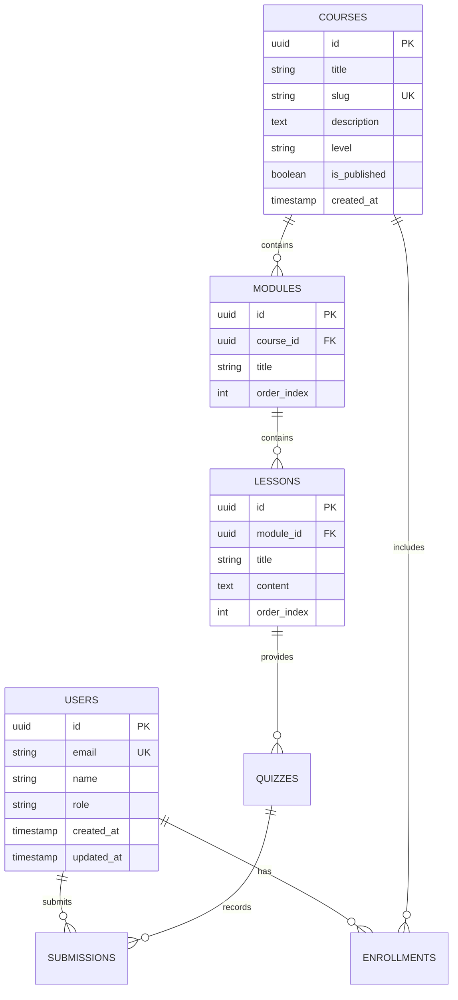

# Database Schema & Data Models - Dream Academy

> **Status:** Draft / Foundation  
> **Owner:** Architect Agent / Builder Agent  
> **Last Updated:** 2026-09-02

---

## 1. Database Engine & Conventions
- **RDBMS:** PostgreSQL 16+
- **Naming Conventions:**
  - Table names: `snake_case`, plural (e.g., `users`, `courses`, `enrollments`).
  - Column names: `snake_case`, singular (e.g., `created_at`, `user_id`, `is_active`).
  - Primary Keys: UUID v4 (`id UUID PRIMARY KEY DEFAULT gen_random_uuid()`).
  - Foreign Keys: `<singular_table_name>_id` (e.g., `user_id`, `course_id`).
  - Timestamps: `created_at TIMESTAMP WITH TIME ZONE DEFAULT NOW()`, `updated_at TIMESTAMP WITH TIME ZONE DEFAULT NOW()`.

---

## 2. Core Entity Relationship Diagram (ERD Concept)

---

## 3. Migration & Version Control Rules
- Setiap perubahan skema **wajib** menggunakan migration tool (misal: Prisma Migrate, Drizzle Kit, Alembic).
- Dilarang mengubah skema secara manual langsung di production database.
- Migration script harus bersifat idempotent dan menyertakan rollback / down migration jika memungkinkan.
