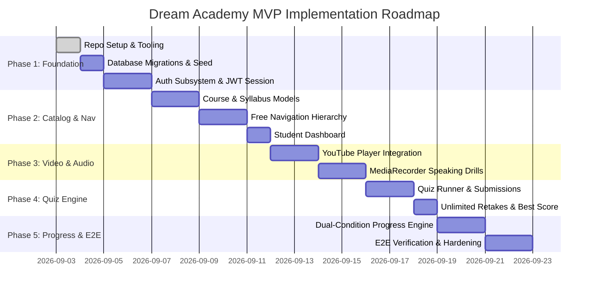

# Implementation Plan & Execution Roadmap — Dream Academy MVP

> **Version:** 1.1 (MVP Implementation Baseline)  
> **Status:** Approved / Ready for Builder & QA Execution  
> **Author:** Architect Agent  
> **Target Audience:** Builder Agent, QA Agent, Product Agent, Human Founder  
> **Last Updated:** 2026-09-02  
> **Reference Documents:** [`docs/PRD.md`](./PRD.md) v1.1, [`docs/ARCHITECTURE.md`](./ARCHITECTURE.md), [`docs/DATABASE.md`](./DATABASE.md), [`docs/API.md`](./API.md), & [`docs/AI_RULES.md`](./AI_RULES.md)

---

## 1. Executive Roadmap Overview

This implementation plan defines the phased execution strategy for the **Dream Academy MVP (v1.1)**. Development is structured into **5 sequential phases**, with strict Definition of Done (DoD) and test verification checkpoints separating each phase.

---

## 2. Phase Breakdown & Execution Specifications

---

### Phase 1: Foundations, Database Infrastructure & Authentication

#### 1.1. Objectives
- Establish the base project structure with Next.js App Router, TypeScript, Tailwind CSS, and testing toolchains (Vitest / RTL).
- Deploy PostgreSQL database schema migrations and seed realistic starter data.
- Implement user registration, secure login, password hashing (Argon2id), and JWT authentication middleware.

#### 1.2. Builder Agent Execution Tasks
- [ ] **TASK-101 (Project Scaffolding):**
  - Initialize Next.js 14+ / React 19 project inside `src/`.
  - Configure `tsconfig.json` (strict mode), `tailwind.config.ts`, `postcss.config.js`, and Lucide icons.
  - Setup Vitest / Jest test runner in `tests/` with helper fixtures.
- [ ] **TASK-102 (Database Migration & ORM Setup):**
  - Setup Prisma or Drizzle ORM configured for PostgreSQL 16+.
  - Apply schema definition from [`docs/DATABASE.md`](./DATABASE.md) (tables: `users`, `courses`, `modules`, `lessons`, `enrollments`, `quizzes`, `quiz_questions`, `quiz_options`, `quiz_attempts`, `lesson_progress`).
  - Create idempotent seed script (`src/db/seed.ts`) populating 1 course, 2 modules, 4 lessons with rich vocabulary, speaking scenarios, and checkpoint quizzes.
- [ ] **TASK-103 (Auth API & Utilities):**
  - Implement Argon2id hashing helper (`src/lib/auth/password.ts`).
  - Implement JWT token generator and verify helpers (`src/lib/auth/jwt.ts`).
  - Create endpoints: `POST /api/v1/auth/register`, `POST /api/v1/auth/login`, `POST /api/v1/auth/refresh`, `GET /api/v1/auth/me`.
- [ ] **TASK-104 (Auth UI Pages):**
  - Build responsive Register and Login forms (`src/app/(auth)/login/page.tsx`, `src/app/(auth)/register/page.tsx`).

#### 1.3. QA Verification Checklist (Phase 1)
- [ ] `tests/auth.test.ts`: Register with valid input returns `201 Created` and JWT token.
- [ ] `tests/auth.test.ts`: Register with duplicate email returns `409 Conflict`.
- [ ] `tests/auth.test.ts`: Register with password $< 8$ chars returns `400 Bad Request`.
- [ ] `tests/auth.test.ts`: Login with valid credentials returns `200 OK`; invalid password returns `401 Unauthorized`.
- [ ] `tests/auth.test.ts`: Protected endpoint rejects missing or malformed Bearer token.
- [ ] Database seed runs cleanly without foreign key violations.

---

### Phase 2: Course Catalog, Free Navigation Syllabus & Student Dashboard

#### 2.1. Objectives
- Implement course catalog listing and detailed syllabus viewing.
- Deliver unrestricted **Free Navigation** allowing immediate access to any module and lesson.
- Implement the Student Dashboard with enrolled courses, progress stats, and *"Continue Learning"* shortcuts.

#### 2.2. Builder Agent Execution Tasks
- [ ] **TASK-201 (Course Catalog API & UI):**
  - Implement `GET /api/v1/courses` and `GET /api/v1/courses/:idOrSlug`.
  - Implement `POST /api/v1/courses/:id/enroll` (free enrollment).
  - Build Course Catalog Page (`src/app/courses/page.tsx`) with search and level filters.
- [ ] **TASK-202 (Free Navigation Syllabus & Sidebar):**
  - Build Course Detail & Syllabus view (`src/app/courses/[courseSlug]/page.tsx`).
  - Create responsive Navigation Sidebar (`src/components/navigation/SyllabusSidebar.tsx`) with breadcrumbs and direct links to all lessons.
  - Ensure zero sequential locks or route guards preventing access to later lessons.
- [ ] **TASK-203 (Student Dashboard):**
  - Implement `GET /api/v1/dashboard/summary`.
  - Build Student Dashboard UI (`src/app/dashboard/page.tsx`) displaying greeting, active courses, progress bars, and *"Lanjutkan Belajar"* button linking to `last_accessed_at` lesson.

#### 2.3. QA Verification Checklist (Phase 2)
- [ ] User can freely open Lesson 4 without having viewed Lesson 1, 2, or 3 (AC-02).
- [ ] Course enrollment creates an `enrollments` record with initial `0.00%` progress.
- [ ] Dashboard correctly displays user full name and lists enrolled courses.
- [ ] *"Lanjutkan Belajar"* shortcut routes directly to the most recently accessed lesson.

---

### Phase 3: Video-Based Lesson & In-Browser Speaking Practice (MediaRecorder)

#### 3.1. Objectives
- Implement YouTube embedded player with responsive 16:9 container, playback tracking, and completion API trigger.
- Implement local in-browser speaking practice with `MediaRecorder` API, shadowing text, instant audio playback, and retake controls.
- Enforce strict **Zero Cloud Audio Storage** guarantee.

#### 3.2. Builder Agent Execution Tasks
- [ ] **TASK-301 (Lesson Learning Viewer Page):**
  - Implement `GET /api/v1/lessons/:id`.
  - Build Lesson Layout (`src/app/courses/[courseSlug]/lessons/[lessonSlug]/page.tsx`) featuring 3 tabs/panels:
    1. Video & Summary
    2. Speaking Practice (Shadowing & Recorder)
    3. Checkpoint Quiz
- [ ] **TASK-302 (YouTube Player Integration):**
  - Create `YouTubePlayer.tsx` using YouTube IFrame API.
  - Track playback reaching $\ge 90\%$ or `YT.PlayerState.ENDED`.
  - Implement `POST /api/v1/lessons/:id/video-complete` API handler.
  - Implement fallback UI when YouTube embed fails or network blocks video.
- [ ] **TASK-303 (In-Browser Speaking Practice Engine):**
  - Create `SpeakingPractice.tsx` and custom hook `useAudioRecorder.ts`.
  - Implement microphone permission request with non-blocking error banner on denial.
  - Buffer audio chunks in memory; convert to `Blob` and generate `URL.createObjectURL(blob)`.
  - Provide controls: **Mulai Rekam**, **Hentikan**, **Putar Ulang**, and **Rekam Ulang**.
  - On "Rekam Ulang", call `URL.revokeObjectURL()` and clear in-memory buffers.
  - Verify zero outbound network requests carry audio binary data.

#### 3.3. QA Verification Checklist (Phase 3)
- [ ] Video iframe renders responsively with 16:9 aspect ratio across desktop and mobile viewports (AC-03).
- [ ] Video completion API triggers once video reaches threshold and updates `video_completed = true`.
- [ ] Microphone permission prompt appears on record button click (AC-04).
- [ ] Recorded audio plays back immediately via local blob URL without server upload (AC-04).
- [ ] Network tab assertion: Zero `POST` or `PUT` calls with `audio/*` or multipart form data.
- [ ] If mic permission is denied, UI shows friendly guide and does not freeze or block quiz access.

---

### Phase 4: Checkpoint Quiz Engine & Unlimited Retakes

#### 4.1. Objectives
- Implement interactive multiple-choice quiz runner with 3–5 questions per lesson.
- Implement secure server-side grading (no answers leaked to client).
- Implement unlimited retakes, recording all attempts and calculating best score.

#### 4.2. Builder Agent Execution Tasks
- [ ] **TASK-401 (Quiz API & Security):**
  - Implement `GET /api/v1/lessons/:id/quiz` (strips `is_correct` from options payload).
  - Implement `POST /api/v1/lessons/:id/quiz/submit` with server-side grading logic:
    $$\text{Score} = \left( \frac{\text{Correct}}{\text{Total}} \right) \times 100$$
  - Implement `GET /api/v1/lessons/:id/quiz/attempts` to view historical attempts.
- [ ] **TASK-402 (Quiz Runner UI & Retake Controller):**
  - Build `QuizRunner.tsx` with question progression, option selection, and submit action.
  - Display immediate result card: Score, **Passed** ($\ge 70\%$) vs **Not Passed** ($< 70\%$), question explanations, and **"Ulangi Kuis"** button.
  - Add client-side resilience: Store in-progress answers in `sessionStorage` in case of connection interruptions.

#### 4.3. QA Verification Checklist (Phase 4)
- [ ] `GET /api/v1/lessons/:id/quiz` JSON payload contains zero `is_correct` properties (AC-05).
- [ ] Submitting answers correctly grades and returns score between 0 and 100.
- [ ] Score $\ge 70\%$ yields `is_passed: true`; score $< 70\%$ yields `is_passed: false`.
- [ ] Multiple submissions record distinct entries in `quiz_attempts` table.
- [ ] If user scores 80% on Attempt 1 and 60% on Attempt 2, `best_quiz_score` remains 80.00%.

---

### Phase 5: Deterministic Dual-Condition Progress Engine & E2E Verification

#### 5.1. Objectives
- Integrate the Dual-Condition Progress Engine:
  $$\text{Lesson Completed} \iff (\text{video\_completed} == \text{true}) \land (\text{best\_quiz\_score} \ge 70)$$
- Implement module and course progress percentage aggregation.
- Perform End-to-End automated testing, edge-case validation, and security audit.

#### 5.2. Builder Agent Execution Tasks
- [ ] **TASK-501 (Progress Engine Subsystem):**
  - Implement atomic database evaluation function in `src/lib/services/progress.service.ts`.
  - Automatically recalculate `enrollments.progress_percentage` whenever a lesson state updates.
  - Implement `GET /api/v1/courses/:id/progress`.
- [ ] **TASK-502 (UI Progress Synchronization):**
  - Sync real-time completion badges on Lesson Header, Syllabus Sidebar, and Dashboard.
  - Display congratulations banner when lesson dual-condition is satisfied.
- [ ] **TASK-503 (E2E Test Suites):**
  - Create full journey E2E test in `tests/e2e/learning_journey.spec.ts`:
    1. Register new user.
    2. Browse course and open Lesson 1.
    3. Complete YouTube video $\rightarrow$ status `in_progress` (video checked, quiz pending).
    4. Record speaking audio $\rightarrow$ verify local playback and zero network upload.
    5. Take Quiz with score $< 70\%$ $\rightarrow$ status remains `in_progress`.
    6. Retake Quiz with score $\ge 70\%$ $\rightarrow$ status changes to `completed`.
    7. Verify Dashboard shows updated progress percentage.

#### 5.3. QA Verification Checklist (Phase 5)
- [ ] Dual-condition progress verification (AC-06):
  | `video_completed` | `best_quiz_score` | Expected Lesson Status |
  | :--- | :--- | :--- |
  | `false` | `0%` | `not_started` / `in_progress` |
  | `true` | `0%` | `in_progress` |
  | `false` | `100%` | `in_progress` |
  | `true` | `66.67%` | `in_progress` |
  | `true` | `70.00%` | **`completed`** |
  | `true` | `100.00%` | **`completed`** |
- [ ] Course progress math verification: $(3 \text{ completed} / 6 \text{ total}) \times 100 = 50.00\%$.
- [ ] All unit, integration, and E2E tests pass with zero failures.

---

## 3. Definition of Done (DoD) & Acceptance Matrix

A feature or pull request is strictly **Done** only when:
1. **Spec Alignment:** Meets all Acceptance Criteria (AC-01 through AC-06) defined in PRD v1.1.
2. **Architectural Integrity:** Strictly adheres to [`docs/ARCHITECTURE.md`](./ARCHITECTURE.md), [`docs/DATABASE.md`](./DATABASE.md), and [`docs/API.md`](./API.md).
3. **Automated Testing:** All unit and integration test suites in `tests/` pass with 100% green status.
4. **Zero Audio Leakage:** Network assertion proves no audio data is transmitted to the server.
5. **No Credentials Leakage:** Verified via pre-commit audit (`.env` only, zero secrets in codebase).
6. **Code Cleanliness:** ESLint and TypeScript compilation pass with zero errors and zero warnings.

---

## 4. Architectural Decisions & Guidance Log

| Decision Code | Topic | Architecture Guidance & Rationale |
| :--- | :--- | :--- |
| **ADR-01** | **Audio Chunk Encoding** | Use `audio/webm;codecs=opus` with fallback to browser default. In-memory `Blob` URLs (`blob:http...`) must be explicitly revoked on retake/unmount to prevent client memory bloat. |
| **ADR-02** | **Quiz Secret Protection** | The `is_correct` field in `quiz_options` is strictly isolated on the backend. Client DTO for quiz queries maps options to `{ id, option_text, order_index }` only. |
| **ADR-03** | **Progress Engine Idempotency** | The progress update query uses PostgreSQL `ON CONFLICT (user_id, lesson_id) DO UPDATE` with `GREATEST` and `OR` operators, ensuring safe concurrent retries without state corruption. |
| **ADR-04** | **Free Navigation State** | Route middleware checks user authentication but **never** checks prerequisite lesson completion flags, guaranteeing 100% free navigation. |
