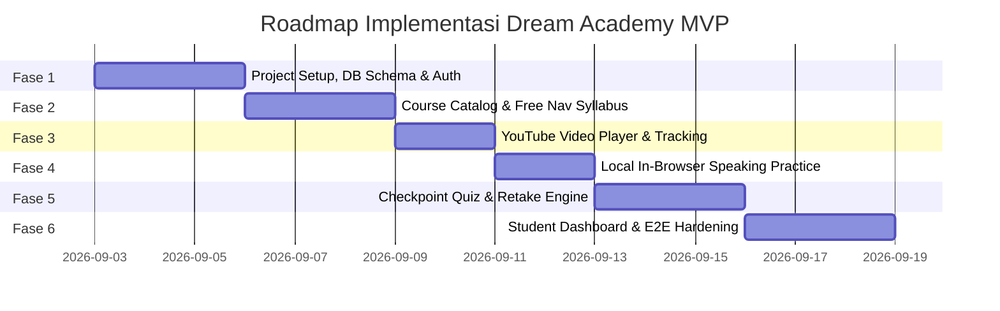
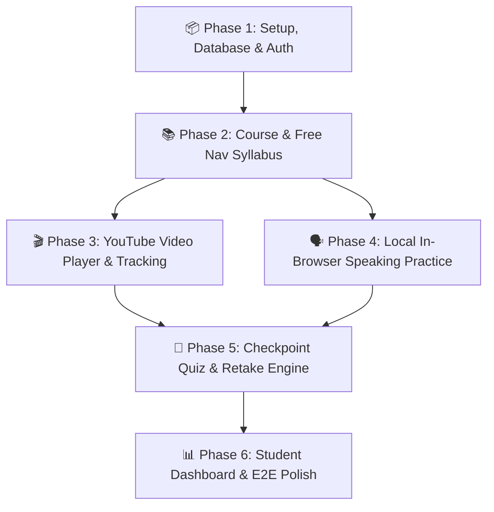

# Technical Implementation Plan & Execution Roadmap — Dream Academy MVP

> **Version:** 1.0 (MVP Implementation Blueprint)  
> **Status:** APPROVED / Ready for Builder Agent Execution  
> **Author:** Architect Agent / Technical Lead  
> **Target Audience:** Builder Agent, QA Agent, & Founder  
> **Last Updated:** 2026-09-02

---

## 1. Overview & Phased Roadmap

Implementasi **Dream Academy MVP** dibagi menjadi **6 Fase Berurutan (*Sequential Development Phases*)**. Setiap fase memiliki batasan deliverable yang jelas, kriteria *Definition of Done (DoD)*, panduan tugas untuk **Builder Agent**, dan daftar verifikasi untuk **QA Agent**.

---

## 2. Feature Dependency Graph

---

## 3. Detailed Phase Breakdown

### Phase 1: Project Setup, Database Schema & Authentication

* **Tujuan:** Menyiapkan kerangka dasar fullstack application, database migration, dan sistem autentikasi pengguna.
* **Dependensi:** None.
* **Tugas Builder Agent:**
  1. Inisialisasi Next.js 14+ (TypeScript, TailwindCSS, App Router) di direktori `src/`.
  2. Setup Prisma ORM / PostgreSQL connection sesuai `docs/DATABASE.md`.
  3. Buat dan jalankan migrasi database awal (`users`, `courses`, `modules`, `lessons`, `enrollments`, `lesson_progress`, `quizzes`, `quiz_questions`, `quiz_options`, `quiz_attempts`).
  4. Implementasikan `AuthService` dan route handlers:
     - `POST /api/v1/auth/register` (hashing password Argon2/bcrypt).
     - `POST /api/v1/auth/login` (penerbitan JWT HttpOnly cookie).
     - `GET /api/v1/auth/me`.
  5. Buat halaman UI `/login` dan `/register` dengan validasi client-side.
* **Verifikasi QA Agent:**
  - [ ] Registrasi akun baru berhasil menyimpan data user dengan password terenkripsi.
  - [ ] Login dengan email/password salah menghasilkan status `401 Unauthorized`.
  - [ ] Token tersimpan aman di HttpOnly cookie dan tidak dapat dibaca via `document.cookie` (XSS protection).
* **Definition of Done (DoD):** Seluruh unit test auth passing, migrasi DB berjalan bersih tanpa error.

---

### Phase 2: Course Catalog & Free Navigation Syllabus

* **Tujuan:** Menyediakan katalog kursus, struktur modul, dan pembukaan lesson tanpa penguncian materi (*PRD-01: Free Navigation*).
* **Dependensi:** Phase 1 (Database & Auth).
* **Tugas Builder Agent:**
  1. Buat seed script untuk memasukkan 1 kursus contoh (*"Confident English Speaking Foundation"*), 2 modul, dan 4 lesson.
  2. Implementasikan API:
     - `GET /api/v1/courses` (katalog kursus).
     - `GET /api/v1/courses/:slug` (detail silabus & modul).
     - `POST /api/v1/courses/:courseId/enroll`.
  3. Buat halaman katalog kursus dan halaman silabus kursus.
  4. Pastikan UI mengizinkan siswa mengklik lesson mana pun tanpa blokir sekuensial.
* **Verifikasi QA Agent:**
  - [ ] Siswa dapat membuka Lesson 3 atau 4 secara langsung tanpa harus menyelesaikan Lesson 1 & 2 terlebih dahulu.
  - [ ] Struktur hierarki Course → Module → Lesson ditampilkan secara rapi dan responsif.
* **Definition of Done (DoD):** Seluruh silabus dapat dijelajahi secara bebas, data seed terpasang di database.

---

### Phase 3: YouTube Video Player & Tracking Engine

* **Tujuan:** Mengintegrasikan pemutar video YouTube responsif dan sistem pencatatan video selesai.
* **Dependensi:** Phase 2 (Course & Lesson View).
* **Tugas Builder Agent:**
  1. Buat komponen `YouTubePlayer` menggunakan YouTube IFrame API.
  2. Implementasikan event listener untuk mendeteksi `YT.PlayerState.ENDED` atau threshold waktu tonton $\ge 90\%$.
  3. Implementasikan API `POST /api/v1/lessons/:lessonId/video-complete`.
  4. Sediakan fallback UI jika video gagal dimuat / adblocker aktif.
* **Verifikasi QA Agent:**
  - [ ] Video YouTube dapat di-play, pause, dan fullscreen dengan aspek rasio 16:9 di mobile & desktop.
  - [ ] Menonton video hingga tuntas mengirimkan status `video_completed = true` ke database.
  - [ ] Fallback UI tampil saat koneksi YouTube offline.
* **Definition of Done (DoD):** Pelacakan video berjalan andal tanpa mengunci antarmuka siswa.

---

### Phase 4: Local In-Browser Speaking Practice (PRD-04)

* **Tujuan:** Menyediakan fitur latihan berbicara dengan perekam suara lokal browser tanpa transmisi data ke server.
* **Dependensi:** Phase 2 (Lesson View UI).
* **Tugas Builder Agent:**
  1. Buat custom hook `useAudioRecorder` memanfaatkan `navigator.mediaDevices.getUserMedia` & `MediaRecorder API`.
  2. Buat komponen UI `SpeakingPracticeSection`:
     - Teks skenario percakapan dan instruksi *shadowing*.
     - Tombol Rekam, Hentikan, Putar Ulang (Audio Player Lokal), dan Rekam Ulang.
  3. Pastikan audio disimpan hanya sebagai temporary in-memory `Blob URL` dan di-release (`revokeObjectURL`) saat retake/unmount.
  4. **Strict Safety:** Pastikan sama sekali tidak ada network payload/endpoint upload audio.
* **Verifikasi QA Agent:**
  - [ ] Mikrofon meminta izin (*permission prompt*) hanya saat tombol rekam pertama kali diklik.
  - [ ] Siswa dapat mendengarkan suaranya sendiri dengan jelas melalui playback lokal.
  - [ ] Memeriksa Network tab pada DevTools: **PASTIKAN 0 byte audio yang diunggah ke internet**.
* **Definition of Done (DoD):** Fitur rekam lokal berfungsi lancar pada Chrome, Firefox, Safari, dan Mobile Browser.

---

### Phase 5: Checkpoint Quiz, Unlimited Retakes & Dual-Trigger Completion

* **Tujuan:** Mengimplementasikan kuis interaktif, pencatatan seluruh attempt, evaluasi *highest score*, dan status tuntas lesson (*PRD-02 & PRD-03*).
* **Dependensi:** Phase 3 (Video Tracking) & Phase 4 (Speaking Practice).
* **Tugas Builder Agent:**
  1. Implementasikan API:
     - `GET /api/v1/quizzes/:quizId` (pertanyaan kuis tanpa flag `is_correct`).
     - `POST /api/v1/quizzes/:quizId/submit` (koreksi backend, simpan attempt, kalkulasi best score).
     - `GET /api/v1/quizzes/:quizId/attempts` (riwayat attempt).
  2. Implementasikan `ProgressService.evaluateLessonCompletion`:
     - Evaluasi rumus: `video_completed == true && best_quiz_score >= 70`.
     - Update status `is_completed` dan `completed_at` pada tabel `lesson_progress`.
  3. Buat komponen UI Kuis: Pilihan ganda, banner skor & kelulusan, pembahasan jawaban, tombol ulangi kuis (*retake*), dan riwayat nilai.
* **Verifikasi QA Agent:**
  - [ ] Kuis bernilai $\ge 70\%$ berstatus **Passed**; $< 70\%$ berstatus **Not Passed**.
  - [ ] Mengulang kuis 3 kali menyimpan 3 baris di `quiz_attempts` dan menampilkan *Highest Score* dengan tepat.
  - [ ] Status lesson berubah menjadi `Completed` HANYA JIKA video sudah selesai DAN kuis $\ge 70\%$.
* **Definition of Done (DoD):** Dual-condition completion teruji dengan unit dan integration tests.

---

### Phase 6: Student Dashboard, Aggregated Progress & End-to-End QA Hardening

* **Tujuan:** Menampilkan ringkasan progres belajar terpusat di dashboard dan melakukan validasi menyeluruh sistem.
* **Dependensi:** Seluruh fase sebelumnya (Phase 1–5).
* **Tugas Builder Agent:**
  1. Implementasikan API `GET /api/v1/dashboard` (kalkulasi persentase kursus, daftar modul, shortcut lanjut belajar).
  2. Buat halaman `/dashboard` dengan visual progress bar, kartu kursus aktif, dan riwayat capaian.
  3. Polish UI & UX responsif pada mobile dan desktop viewport.
* **Verifikasi QA Agent:**
  - [ ] Menjalankan skenario E2E: Register → Buka Silabus → Tonton Video → Rekam Speaking → Kerjakan Kuis → Cek Dashboard (Progres bertambah akurat).
  - [ ] Audit keamanan: Bebas kebocoran secret key, validasi input Zod bekerja pada seluruh endpoint.
* **Definition of Done (DoD):** Seluruh E2E test suite lulus 100%, sistem siap untuk demonstrasi (*release ready*).

---

## 4. Definition of Done (DoD) Universal untuk Builder Agent

Setiap kali Builder Agent menyelesaikan task atau sub-fitur:
1. **Spec Alignment:** Kode sesuai 100% dengan `docs/ARCHITECTURE.md`, `docs/DATABASE.md`, dan `docs/API.md`.
2. **Automated Tests:** Disertai unit / integration test dengan coverage memadai.
3. **No Secret Leakage:** Tidak ada API key, token, atau kredensial yang di-commit.
4. **Git Hygiene:** Bekerja pada feature branch (`feature/*`) dan membuat Pull Request sesuai `.github/pull_request_template.md`.
