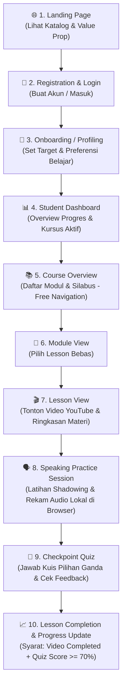

# Product Requirements Document (PRD) — Dream Academy

> **Version:** 1.1 (MVP Final Specification)  
> **Status:** Finalized MVP / Ready for Architecture Review  
> **Target Audience:** Product Agent, Architect Agent, Builder Agent, QA Agent, & Founder  
> **Last Updated:** 2026-09-02

---

## 1. Product Vision
**Dream Academy** adalah platform e-learning modern yang dirancang khusus untuk pembelajar bahasa Inggris di Indonesia, dengan fokus utama membangun **keberanian, kepercayaan diri, dan kelancaran (*fluency*) dalam berbicara (speaking)** tanpa rasa takut berlebihan terhadap kesalahan tata bahasa (*grammar perfectionism*).

Platform ini menggabungkan kurikulum terstruktur, materi video berbasis konteks nyata (YouTube-integrated), latihan mandiri dengan perekam suara lokal peramban (*local browser audio recording*), kuis evaluasi instan, serta pemantauan progres yang memotivasi siswa untuk terus berlatih setiap hari.

---

## 2. Problem
1. **Grammar Anxiety & Fear of Making Mistakes:** Mayoritas pembelajar di Indonesia menghabiskan bertahun-tahun mempelajari teori grammar di sekolah formal, namun tetap merasa takut dan kaku saat berbicara karena takut dihakimi atau salah tata bahasa.
2. **Passive Consumption without Active Practice:** Banyak kursus online hanya menyajikan video materi pasif tanpa alur latihan aktif (*active recall & speaking practice*) yang langsung diterapkan setelah menonton.
3. **Overwhelmed & Lack of Direction:** Pembelajar mandiri sering tersesat dalam ribuan video acak di internet tanpa jalur belajar (*learning path*) yang runtut, terukur, dan memantau kemajuan mereka secara bertahap.

---

## 3. Target Users

### Primary Persona: "The Hesitant Professional / University Student"
- **Demografi:** Mahasiswa, *fresh graduate*, dan profesional muda Indonesia (Usia: 18–35 tahun).
- **Karakteristik & Latar Belakang:**
  - Memiliki pemahaman pasif bahasa Inggris tingkat dasar hingga menengah (*passive vocabulary & reading* cukup baik).
  - Mengalami hambatan mental (*mental block*) saat harus berbicara dalam rapat kerja, wawancara kerja, atau percakapan sehari-hari.
  - Membutuhkan lingkungan belajar mandiri yang aman (*safe environment*), fleksibel, dan fokus pada kelancaran komunikasi.

---

## 4. User Jobs / User Needs
1. **Job 1 (Learn & Understand):** Menonton materi pembelajaran video yang ringkas, praktis, dan kontekstual tanpa merasa digurui.
2. **Job 2 (Practice Speaking Safely):** Melakukan latihan berbicara (*speaking practice*) berdasarkan skenario nyata, merekam suara sendiri secara privat di browser, dan mendengarkan kembali tanpa rasa cemas dinilai pihak lain.
3. **Job 3 (Self-Assess & Validate):** Mengukur pemahaman materi melalui kuis interaktif dengan umpan balik langsung dan kebebasan mengulang kuis untuk mencapai nilai terbaik.
4. **Job 4 (Track Progress):** Memilih materi secara bebas (*free navigation*) dan melihat rekam jejak penyelesaian modul, nilai terbaik kuis, serta persentase capaian belajar di satu dashboard terpusat.

---

## 5. Value Proposition
1. **Confidence-First Philosophy:** Kurikulum dan instruksi dirancang untuk mengutamakan pesan tersampaikan (*communication over perfection*).
2. **Curated YouTube-Based Video Delivery:** Integrasi video pembelajaran berkualitas tinggi yang familiar, ringan, dan cepat dimuat melalui YouTube player.
3. **Frictionless Free Navigation:** Memberikan kebebasan penuh bagi pembelajar dewasa untuk menjelajahi lesson mana pun tanpa penguncian materi (*no lesson locking*).
4. **Private In-Browser Speaking Practice:** Fitur rekam suara lokal yang aman, instan, dan bebas privasi tanpa memerlukan penyimpanan audio di server.
5. **Clean & Motivating Dashboard:** Tampilan antarmuka yang bersih, fokus pada pembelajaran, dan bebas distraksi.

---

## 6. Core User Journey

---

## 7. MVP Scope

### 7.1. Must Have (Prioritas Utama MVP)
1. **Autentikasi & Akun Pengguna:** Register, Login, Logout, dan Pengaturan Profil Siswa sederhana.
2. **Student Dashboard:** Ringkasan kursus yang sedang diikuti, persentase progres total, dan tombol lanjut belajar (*Continue Learning*).
3. **Hierarki Silabus Bebas (Free Navigation):** Halaman kursus, modul bertopik, dan lesson yang dapat diakses langsung tanpa penguncian sekuensial (*no sequential lock*).
4. **Video-Based Lesson (YouTube Integration):** Pemutaran video pembelajaran YouTube yang responsif dengan pelacakan pemutaran video (*video completion condition*).
5. **Local Browser Speaking Practice:** Latihan berbicara terpandu dengan skenario percakapan, instruksi *shadowing*, perekaman mikrofon lokal peramban (*MediaRecorder API*), pemutaran ulang (*playback*), dan *retake recording* tanpa upload ke server.
6. **Checkpoint Quiz & Unlimited Retakes:** Kuis pilihan ganda (3–5 soal) dengan passing grade minimal 70%, pencatatan seluruh histori attempt, dan penyimpanan *highest score* sebagai nilai terbaik.
7. **Dual-Condition Progress Engine:** Sebuah lesson ditandai **Completed** hanya jika:
   - Video telah memenuhi kondisi selesai (*Video Completed*), **DAN**
   - Nilai kuis mencapai ambang batas (*Quiz Score $\ge 70\%$*).

### 7.2. Should Have (Phase 1.5)
- Filter dan pencarian katalog kursus berdasarkan topik/level.
- Dark mode toggle pada antarmuka.

### 7.3. Later / Future (Phase 2+)
- AI Speaking Coach & Pronunciation Assessment berbasis LLM / Speech-to-Text.
- Cloud Audio Storage & Mentor Feedback.
- Integrasi Payment Gateway & Pembelian Kursus Berbayar.
- Automated Digital Certificate Generator (PDF).
- Forum Diskusi Antar-Siswa / Komunitas.

---

## 8. Feature Requirements (MVP Concrete Specifications)

### FR-01: Authentication & User Management
- Mendukung pendaftaran akun dengan email dan password.
- Validasi format email dan enkripsi kata sandi yang aman (bcrypt/argon2).
- Autentikasi berbasis session / JWT token.

### FR-02: Student Dashboard
- Menampilkan sapaan nama pengguna, kartu kursus aktif, persentase penyelesaian, dan shortcut *"Lanjutkan Belajar"*.
- Menampilkan daftar semua kursus yang tersedia untuk diikuti.

### FR-03: Video-Based Lesson & YouTube Integration
- Memutar video pembelajaran menggunakan YouTube Embedded Player yang responsif.
- Menghitung pemenuhan kondisi video selesai secara andal tanpa mengunci interaksi pengguna secara kaku.
- Menyediakan tab/panel materi pendukung: Ringkasan Kosakata (*Key Vocabulary*), Contoh Kalimat Percakapan (*Speaking Scenarios*), dan Tips Keberanian Berbicara.

### FR-04: Local Browser Speaking Practice
- Menyajikan skenario percakapan kontekstual dan teks panduan *shadowing*.
- Menggunakan API browser (`navigator.mediaDevices.getUserMedia` & `MediaRecorder`) untuk merekam suara siswa langsung di peramban.
- Menyediakan tombol kontrol: **Mulai Rekam**, **Hentikan**, **Putar Ulang (Playback Audio)**, dan **Rekam Ulang (Retake)**.
- **Zero Cloud Storage:** Audio hasil rekaman disimpan sementara di memori browser (Blob URL) dan tidak dikirimkan/diunggah ke server.

### FR-05: Checkpoint Quiz & Score Tracking
- Menyajikan 3–5 butir soal pilihan ganda per lesson.
- Menghitung skor kuis (skala 0–100) secara otomatis setelah submit.
- **Passing Grade:** Nilai $\ge 70\%$ dinyatakan **Lulus (Passed)**; nilai $< 70\%$ dinyatakan **Belum Lulus**.
- **Unlimited Retake Policy:** Siswa bebas mengulang kuis kapan saja tanpa batasan jumlah pengulangan.
- **Attempt History & Best Score:** Sistem menyimpan setiap rekaman percobaan (*attempt history*) dan mengambil nilai tertinggi (*highest score*) sebagai nilai acuan capaian belajar.

### FR-06: Dual-Trigger Progress & Completion Engine
- Status kelulusan lesson bersifat deterministik berdasarkan 2 syarat wajib:
  1. Kondisi video selesai terpenuhi (`video_completed = true`).
  2. Nilai kuis terbaik mencapai passing grade (`highest_quiz_score >= 70`).
- Jika kedua syarat terpenuhi, sistem otomatis menetapkan status lesson menjadi `completed` dan mengalkulasi ulang persentase progres modul serta kursus.

---

## 9. User Stories

| ID | As a... | I want to... | So that... |
| :--- | :--- | :--- | :--- |
| **US-01** | Siswa Baru | Mendaftar akun dengan email & password | Saya memiliki akun personal untuk menyimpan riwayat belajar. |
| **US-02** | Siswa | Melihat dashboard pembelajaran saya | Saya mengetahui posisi modul terakhir dan persentase capaian belajar. |
| **US-03** | Siswa | Membuka lesson mana pun secara bebas | Saya dapat belajar sesuai kebutuhan spesifik saya tanpa harus menunggu lesson sebelumnya selesai (*free navigation*). |
| **US-04** | Siswa | Menonton video materi YouTube di dalam platform | Saya mendapatkan penjelasan konsep speaking dengan jelas dan visual. |
| **US-05** | Siswa | Merekam suara latihan saya di browser dan memutar ulangnya | Saya dapat mengevaluasi pelafalan saya secara mandiri dan privat tanpa cemas dinilai orang lain. |
| **US-06** | Siswa | Mengerjakan kuis checkpoint dan mengulanginya jika belum puas | Saya dapat menguji pemahaman saya dan meningkatkan skor saya ke nilai tertinggi (*highest score*). |
| **US-07** | Siswa | Melihat riwayat percobaan kuis dan skor terbaik | Saya mengetahui peningkatan pemahaman saya dari percobaan ke percobaan. |
| **US-08** | Siswa | Melihat status lesson menjadi *Completed* setelah video ditonton dan kuis $\ge 70\%$ | Saya mendapatkan apresiasi atas ketuntasan belajar materi tersebut. |

---

## 10. Acceptance Criteria

### AC-01: User Registration & Login
- [ ] User dapat mendaftar dengan input: Nama Lengkap, Email Valid, Password (minimal 8 karakter).
- [ ] Sistem menolak registrasi jika email sudah terdaftar dengan pesan error yang jelas.
- [ ] Setelah login berhasil, user diarahkan ke `/dashboard`.

### AC-02: Free Navigation Silabus
- [ ] User dapat mengakses halaman silabus kursus dan membuka lesson mana pun tanpa terkunci (*no sequential lock*).
- [ ] Navigasi antar-lesson dapat dilakukan secara langsung melalui sidebar atau breadcrumb.

### AC-03: YouTube Video Playback & Tracking
- [ ] Video YouTube ter-embed dengan iframe responsif (aspek rasio 16:9).
- [ ] Video dapat diputar, dijeda, dan diatur volumenya secara lancar pada desktop maupun mobile browser.
- [ ] Kondisi penyelesaian video tercatat secara andal dan toleran terhadap koneksi.

### AC-04: Local Browser Speaking Practice
- [ ] Browser meminta izin mikrofon saat user mengklik *"Mulai Rekam"*.
- [ ] Terdapat indikator visual durasi saat proses perekaman aktif.
- [ ] Setelah selesai merekam, audio player lokal langsung tersedia untuk memutar kembali suara siswa.
- [ ] User dapat menekan *"Rekam Ulang"* untuk menghapus rekaman lama dan membuat rekaman baru di memori browser.
- [ ] Tidak ada panggilan API upload berkas audio ke backend/server.

### AC-05: Quiz Evaluation, Passing Grade, & Retake
- [ ] Soal kuis ditampilkan interaktif dan submit menghasilkan skor (0–100).
- [ ] Jika skor $\ge 70\%$, kuis berstatus **Passed**; jika $< 70\%$, kuis berstatus **Not Passed**.
- [ ] Setiap percobaan kuis tersimpan sebagai entitas *attempt* baru (waktu submit, skor, detail jawaban).
- [ ] Sistem menampilkan *Best Score (Highest Score)* di UI lesson dan dashboard.
- [ ] Tombol *"Ulangi Kuis"* selalu tersedia tanpa batas.

### AC-06: Dual-Condition Lesson Completion & Progress Calculation
- [ ] Lesson berstatus `completed` HANYA jika `video_completed == true` DAN `best_quiz_score >= 70`.
- [ ] Jika salah satu syarat belum terpenuhi, lesson tetap berstatus `in_progress`.
- [ ] Persentase progres modul dan kursus dihitung otomatis: `(Jumlah Lesson Completed / Total Lesson) * 100%`.
- [ ] Dashboard langsung memperbarui progres saat lesson dinyatakan complete.

---

## 11. Non-Goals (Out of Scope for MVP)
- **NO Payment Gateway Integration:** Seluruh kursus di tahap MVP bersifat *free access* / *mock enrollment*.
- **NO Cloud Audio Storage:** Berkas rekaman suara siswa TIDAK disimpan di server/database cloud mana pun.
- **NO AI Speech / Pronunciation Analysis:** Tidak ada komputasi AI speech-to-text atau scoring aksen otomatis.
- **NO Sequential Lesson Locking:** Tidak ada pemblokiran materi yang mewajibkan penyelesaian berurutan.
- **NO Internal Video Upload/Hosting:** Seluruh video memanfaatkan integrasi YouTube embed (publik/unlisted).
- **NO Mobile Native App (iOS/Android):** Fokus MVP adalah Responsive Web App (PWA-ready).
- **NO Instructor Content Creator CMS Portal:** Konten kursus MVP diinisialisasi melalui seed data / database admin.

---

## 12. Success Metrics

| Metrik | Definisi & Tujuan | Target MVP |
| :--- | :--- | :--- |
| **Lesson Completion Rate** | Persentase lesson yang berhasil memenuhi syarat tuntas (Video + Kuis $\ge 70\%$) | [TBD] |
| **Quiz Retake Engagement** | Rata-rata jumlah pengulangan kuis per user untuk mencapai skor $\ge 70\%$ | [TBD] |
| **Speaking Practice Usage** | Persentase user yang mencoba fitur rekam audio lokal minimal 1 kali per lesson | [TBD] |
| **Daily Active Retention (D1 / D7)** | Persentase user yang kembali belajar dalam 1 hari dan 7 hari setelah mendaftar | [TBD] |
| **Platform Crash / Error Rate** | Jumlah insiden error saat memuat video/audio/kuis pada level production | < 1% dari total sesi |

---

## 13. Edge Cases & Handling

1. **User Menolak Izin Mikrofon Browser (*Microphone Permission Denied*):**  
   *Handling:* Tampilkan banner panduan ramah pengguna (*"Izin mikrofon diperlukan untuk fitur latihan rekam suara"*). Tetap izinkan user membaca teks latihan dan melanjutkan ke kuis tanpa memblokir alur belajar.
2. **Video YouTube Dihapus / Tidak Dapat Dimuat (*Embed Error*):**  
   *Handling:* Tampilkan fallback UI (*"Video materi sedang dalam pembaruan"*) beserta ringkasan teks materi dan tombol cadangan agar siswa tetap dapat melanjutkan ke latihan dan kuis.
3. **Koneksi Internet Terputus Saat Submit Kuis:**  
   *Handling:* Simpan jawaban sementara di local storage browser; sediakan tombol *"Coba Kirim Ulang"* saat koneksi pulih tanpa menghapus pilihan jawaban siswa.
4. **Siswa Mengulang Kuis dan Mendapat Nilai Lebih Rendah:**  
   *Handling:* Nilai tertinggi sebelumnya (*highest score*) tetap dipertahankan sebagai acuan status kelulusan lesson. Attempt baru tetap dicatat di histori.

---

## 14. Definition of Done (DoD) for MVP Features

Sebuah fitur atau user story dinyatakan **SELESAI (Done)** jika memenuhi seluruh syarat berikut:
1. **Spec Compliance:** Memenuhi seluruh Acceptance Criteria yang tertulis di PRD v1.1 ini.
2. **Code Hygiene & Architecture:** Mengikuti arsitektur dan pola kode yang disetujui Architect Agent.
3. **Automated Testing:** Dilengkapi unit test dan integration test yang relevan, dengan status passing (*green*).
4. **Zero Audio Leakage:** Memastikan tidak ada transmisi data audio rekaman ke server backend.
5. **No Security Leakage:** Bebas dari hardcoded token, API key, atau data kredensial.
6. **PR Checklist:** Pull Request dibuat dengan template resmi dan telah di-review tanpa pelanggaran `docs/AI_RULES.md`.

---

## 15. Finalized Product Decisions Log (MVP v1.1)

| Decision ID | Area | Final Decision | Rationale / Key Constraint |
| :--- | :--- | :--- | :--- |
| **PRD-01** | **Lesson Navigation** | **Free Navigation** | Pembelajar dewasa/profesional membutuhkan fleksibilitas; tidak ada *lesson locking* di MVP. |
| **PRD-02** | **Lesson Completion** | **Video Completed + Quiz Passed ($\ge 70\%$)** | Menjamin tercapainya pemahaman esensial (menonton video materi dan menguji pemahaman lewat kuis). Implementasi pelacakan video ditentukan oleh Architect Agent agar andal dan tidak kaku. |
| **PRD-03** | **Quiz Retake Policy** | **Unlimited Retakes + Highest Score** | Mendukung proses belajar berkelanjutan tanpa hukuman; seluruh histori attempt dicatat, nilai tertinggi dijadikan acuan status lulus. |
| **PRD-04** | **Speaking Practice** | **Local Browser Recording Only** | Siswa dapat merekam dan mengevaluasi suara secara privat di browser. Nol penyimpanan cloud dan tanpa analisis AI di MVP. |
