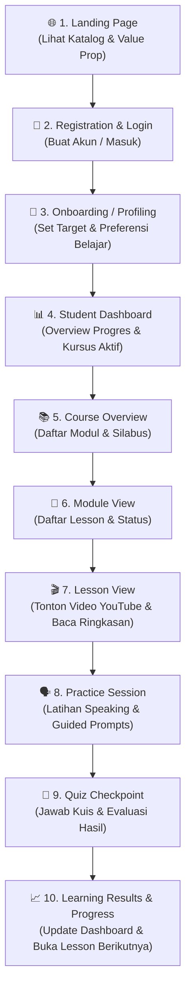

# Product Requirements Document (PRD) — Dream Academy

> **Version:** 1.0 (MVP Specification)  
> **Status:** Draft / Ready for Architecture Review  
> **Target Audience:** Product Agent, Architect Agent, Builder Agent, QA Agent, & Founder  
> **Last Updated:** 2026-09-02

---

## 1. Product Vision
**Dream Academy** adalah platform e-learning modern yang dirancang khusus untuk pembelajar bahasa Inggris di Indonesia, dengan fokus utama membangun **keberanian, kepercayaan diri, dan kelancaran (*fluency*) dalam berbicara (speaking)** tanpa rasa takut berlebihan terhadap kesalahan tata bahasa (*grammar perfectionism*).

Platform ini menggabungkan kurikulum terstruktur, materi video berbasis konteks nyata (YouTube-integrated), latihan mandiri yang ramah psikologis, serta pemantauan progres yang memotivasi siswa untuk terus berlatih setiap hari.

---

## 2. Problem
1. **Grammar Anxiety & Fear of Making Mistakes:** Mayoritas pembelajar di Indonesia menghabiskan bertahun-tahun mempelajari teori grammar di sekolah formal, namun tetap merasa takut dan kaku saat berbicara karena takut dihakimi atau salah tata bahasa.
2. **Passive Consumption without Active Practice:** Banyak kursus online hanya menyajikan video materi pasif tanpa alur latihan aktif (*active recall & speaking practice*) yang langsung diterapkan setelah menonton.
3. **Overwhelmed & Lack of Direction:** Pembelajar mandiri sering tersesat dalam ribuan video acak di internet tanpa jalur belajar (*learning path*) yang runtut, terukur, dan memantau kemajuan mereka secara bertahap.

---

## 3. Target Users

### Primary Persona: "The Hesitant Professional / University Student"
- **Demografi:** Mahasiswa, *fresh graduate*, dan profesional muda Indonesia (Usia: 18–35 tahun).
- **Karakteristik & Latar Belakang:**
  - Memiliki pemahaman pasif bahasa Inggris tingkat dasar hingga menengah (*passive vocabulary & reading* cukup baik).
  - Mengalami hambatan mental (*mental block*) saat harus berbicara dalam rapat kerja, wawancara kerja, atau percakapan sehari-hari.
  - Membutuhkan lingkungan belajar yang aman, suportif, dan fokus pada pemahaman kontekstual dibanding hafalan rumus.

---

## 4. User Jobs / User Needs
1. **Job 1 (Learn & Understand):** Menonton materi pembelajaran video yang ringkas, praktis, dan kontekstual tanpa merasa digurui.
2. **Job 2 (Practice Speaking Safely):** Melakukan latihan berbicara (*speaking practice*) berdasarkan skenario nyata segera setelah menonton materi.
3. **Job 3 (Self-Assess & Validate):** Mengukur pemahaman materi melalui kuis interaktif dan mendapatkan umpan balik langsung.
4. **Job 4 (Track Progress):** Melihat rekam jejak penyelesaian modul, persentase kelulusan materi, dan histori capaian belajar di satu dashboard terpusat.

---

## 5. Value Proposition
1. **Confidence-First Philosophy:** Kurikulum dan instruksi dirancang untuk mengutamakan pesan tersampaikan (*communication over perfection*).
2. **Curated YouTube-Based Video Delivery:** Integrasi video pembelajaran berkualitas tinggi yang familiar, ringan, dan cepat dimuat melalui YouTube player.
3. **Action-Oriented Learning Loops:** Setiap lesson langsung disambung dengan latihan terpandu (*guided practice*) dan kuis ringkas (*checkpoint quiz*).
4. **Clean & Motivating Dashboard:** Tampilan antarmuka yang bersih, fokus pada pembelajaran, dan bebas distraksi.

---

## 6. Core User Journey

---

## 7. MVP Scope

### 7.1. Must Have (Prioritas MVP)
1. **Autentikasi & Profil Pengguna:** Register, Login, Logout, dan Pengaturan Profil Siswa sederhana.
2. **Student Dashboard:** Ringkasan kursus yang sedang diikuti, persentase progres total, dan tombol lanjut belajar (*Continue Learning*).
3. **Hierarki Kursus (Course → Module → Lesson):**
   - Halaman detail kursus beserta silabus.
   - Halaman modul yang mengelompokkan topik-topik pembelajaran.
   - Halaman lesson yang mengintegrasikan YouTube video player, teks ringkasan materi, dan transkrip/catatan kunci.
4. **Guided Speaking Practice:** Prompt latihan berbicara terpandu (skenario percakapan, instruksi *shadowing*, dan frasa kunci).
5. **Interactive Checkpoint Quiz:** Kuis pilihan ganda untuk menguji pemahaman lesson dengan scoring otomatis.
6. **Progress Tracking Engine:** Pencatatan status penyelesaian per lesson, modul, dan kursus secara persisten di database.

### 7.2. Should Have (Pasca-MVP / Phase 1.5)
- Audio Voice Recorder untuk latihan speaking mandiri (siswa merekam suara lokal dan memutar ulang untuk evaluasi mandiri).
- Filter dan pencarian katalog kursus.
- Dark mode toggle pada UI.

### 7.3. Later / Future (Phase 2+)
- AI Speaking Coach & Pronunciation Assessment berbasis LLM / Speech-to-Text.
- Sistem Sertifikat Digital otomatis (PDF Generator).
- Integrasi Payment Gateway & Pembelian Kursus Premium.
- Forum Diskusi Antar-Siswa / Komunitas.

---

## 8. Feature Requirements (MVP Concrete Specifications)

### FR-01: Authentication & User Management
- Mendukung pendaftaran akun dengan email dan password.
- Validasi format email dan enkripsi kata sandi (bcrypt/argon2).
- Autentikasi berbasis session / JWT token yang aman.

### FR-02: Student Dashboard
- Menampilkan sapaan nama pengguna, kartu kursus aktif, persentase penyelesaian, dan shortcut *"Lanjutkan Belajar"*.
- Menampilkan daftar semua kursus yang tersedia untuk diikuti.

### FR-03: Video-Based Lesson & YouTube Integration
- Memutar video pembelajaran menggunakan YouTube Embedded Player yang responsif.
- Menyediakan tab/panel materi pendukung: Ringkasan Kosakata (*Key Vocabulary*), Contoh Kalimat Percakapan (*Speaking Scenarios*), dan Tips Keberanian Berbicara.

### FR-04: Guided Practice Session
- Menampilkan skenario speaking kontekstual (misal: "Memesan kopi di kafe", "Memperkenalkan diri dalam interview").
- Panduan *shadowing* bertahap: Dengar → Ucapkan Bersama → Ucapkan Mandiri.

### FR-05: Checkpoint Quiz & Results
- Menampilkan 3–5 soal pilihan ganda per lesson.
- Menampilkan penjelasan ringkas untuk setiap jawaban yang benar maupun salah.
- Menghitung skor akhir kuis secara real-time dan menyimpan histori ke database.

### FR-06: Progress & Completion Tracking
- Tombol *"Tandai Selesai & Lanjut"* yang hanya aktif setelah menyelesaikan kuis atau membuka seluruh materi lesson.
- Update otomatis status progres pada level Modul dan Kursus (0% - 100%).

---

## 9. User Stories

| ID | As a... | I want to... | So that... |
| :--- | :--- | :--- | :--- |
| **US-01** | Siswa Baru | Mendaftar akun dengan email & password | Saya memiliki akun personal untuk menyimpan riwayat belajar. |
| **US-02** | Siswa | Melihat dashboard pembelajaran saya | Saya mengetahui posisi modul terakhir dan dapat langsung melanjutkan belajar. |
| **US-03** | Siswa | Memilih kursus dan melihat silabus terstruktur | Saya memahami tahapan materi yang akan dipelajari dari awal hingga akhir. |
| **US-04** | Siswa | Menonton video YouTube materi di dalam platform | Saya mendapatkan penjelasan konsep speaking dengan jelas dan visual. |
| **US-05** | Siswa | Mengikuti latihan speaking terpandu | Saya terbiasa melafalkan kalimat bahasa Inggris tanpa cemas salah grammar. |
| **US-06** | Siswa | Mengerjakan kuis checkpoint setelah lesson | Saya dapat mengecek pemahaman materi saya secara instan. |
| **US-07** | Siswa | Melihat hasil skor kuis dan feedback | Saya tahu aspek mana yang sudah saya kuasai dan mana yang perlu diulang. |
| **US-08** | Siswa | Melihat persentase progres bertambah saat lesson selesai | Saya merasa termotivasi melihat progres nyata capaian belajar saya. |

---

## 10. Acceptance Criteria

### AC-01: User Registration & Login
- [ ] User dapat mendaftar dengan input: Nama Lengkap, Email Valid, Password (minimal 8 karakter).
- [ ] Sistem menolak registrasi jika email sudah terdaftar dengan pesan error yang jelas.
- [ ] Setelah login berhasil, user diarahkan ke `/dashboard`.

### AC-02: Course & Lesson Navigation
- [ ] User dapat melihat daftar kursus pada katalog/dashboard.
- [ ] Mengklik kursus membuka halaman silabus dengan daftar modul dan lesson berurutan.
- [ ] Mengklik lesson membuka halaman belajar yang memuat: Judul Lesson, YouTube Player, Catatan Materi, Bagian Practice, dan Bagian Quiz.

### AC-03: YouTube Video Embed Playback
- [ ] Video YouTube ter-embed dengan iframe responsif (aspek rasio 16:9).
- [ ] Video dapat diputar, dijeda, dan diatur volumenya secara lancar pada desktop maupun mobile browser.

### AC-04: Practice & Quiz Evaluation
- [ ] Soal kuis ditampilkan satu per satu atau dalam satu form kuis interaktif.
- [ ] Setelah submit, sistem menampilkan nilai (0-100), status lulus/belum lulus (Passing Grade: TBD), dan pembahasan tiap butir soal.
- [ ] Hasil kuis tersimpan di database dan terhubung ke `user_id` dan `lesson_id`.

### AC-05: Progress Calculation
- [ ] Menyelesaikan suatu lesson memperbarui counter lesson selesai pada modul dan kursus terkait.
- [ ] Nilai persentase progres terhitung secara akurat: `(Jumlah Lesson Selesai / Total Lesson) * 100%`.
- [ ] Dashboard menampilkan persentase terbaru saat di-refresh.

---

## 11. Non-Goals (Out of Scope for MVP)
- **NO Payment Gateway Integration:** Seluruh kursus di tahap MVP bersifat *free access* / *mock enrollment*.
- **NO Real-time AI Speech Evaluation:** Belum ada analisis audio AI otomatis atau penilaian aksen via LLM.
- **NO Video Upload Hosting (S3/Cloudflare Stream):** Seluruh video memanfaatkan integrasi YouTube embed (publik/unlisted).
- **NO Mobile Native App (iOS/Android):** Fokus MVP adalah Responsive Web App (PWA-ready).
- **NO Instructor Content Creator CMS Portal:** Konten kursus MVP diinisialisasi melalui seed data / database admin.

---

## 12. Success Metrics

| Metrik | Definisi & Tujuan | Target MVP |
| :--- | :--- | :--- |
| **Lesson Completion Rate** | Persentase lesson yang diselesaikan oleh user yang memulai kursus | [TBD] |
| **Quiz Pass Rate** | Persentase user yang berhasil lulus kuis checkpoint pada percobaan pertama | [TBD] |
| **Daily Active Retention (D1 / D7)** | Persentase user yang kembali belajar dalam 1 hari dan 7 hari setelah mendaftar | [TBD] |
| **Platform Crash / Error Rate** | Jumlah insiden error saat memuat video/kuis pada level production | < 1% dari total sesi |

---

## 13. Edge Cases & Handling

1. **Video YouTube Tidak Tersedia / Dihapus / Region-Locked:**  
   *Handling:* Tampilkan fallback UI ramah pengguna (*"Video materi sedang dalam pembaruan"*) beserta ringkasan teks dan materi latihan tertulis agar siswa tetap dapat belajar.
2. **Koneksi Internet Terputus Saat Mengerjakan Kuis:**  
   *Handling:* Simpan status jawaban kuis di local storage browser sementara waktu; berikan opsi *"Coba Kirim Ulang"* saat koneksi pulih tanpa menghilangkan jawaban.
3. **User Mengakses Lesson Secara Acak (Loncat Materi):**  
   *Handling:* [DECISION REQUIRED] Apakah lesson wajib diselesaikan secara sekuensial (terkunci sebelum lesson sebelumnya selesai) atau bebas dibuka kapan saja (*free navigation*)?
4. **Kuis Dikerjakan Ulang (*Retake*):**  
   *Handling:* Simpan nilai tertinggi (*highest score*) atau nilai percobaan terakhir (*latest score*) ke dalam database.

---

## 14. Definition of Done (DoD) for MVP Features

Sebuah fitur atau user story dinyatakan **SELESAI (Done)** jika memenuhi seluruh syarat berikut:
1. **Spec Compliance:** Memenuhi seluruh Acceptance Criteria yang tertulis di PRD ini.
2. **Code Hygiene & Architecture:** Mengikuti arsitektur dan pola kode yang disetujui Architect Agent.
3. **Automated Testing:** Dilengkapi unit test dan integration test yang relevan, dengan status passing (*green*).
4. **No Security Leakage:** Bebas dari hardcoded token, API key, atau data sensitif.
5. **PR Checklist:** Pull Request dibuat dengan template resmi dan telah di-review tanpa pelanggaran `docs/AI_RULES.md`.

---

## 15. Product Decisions Requiring Founder Input (`[DECISION REQUIRED]`)

1. **[DECISION REQUIRED - PRD-01] Kebijakan Akses Lesson (Sequential vs Free Navigation):**  
   Apakah siswa **wajib** menyelesaikan Lesson 1 untuk membuka Lesson 2 (alur sekuensial/terkunci), atau siswa dibebaskan memilih dan membuka lesson mana pun sesuai keinginan?
2. **[DECISION REQUIRED - PRD-02] Kriteria Penyelesaian Lesson (*Lesson Completion Trigger*):**  
   Kapan sebuah lesson dianggap resmi "Selesai" oleh sistem?  
   - *Opsi A:* Siswa cukup lulus Kuis Checkpoint dengan nilai di atas passing grade (misal: $\ge 70\%$).  
   - *Opsi B:* Siswa wajib menonton video hingga selesai (menggunakan YouTube IFrame API tracking) **DAN** lulus kuis.  
   - *Opsi C:* Siswa menekan tombol manual *"Selesai & Lanjut"* setelah kuis selesai.
3. **[DECISION REQUIRED - PRD-03] Kebijakan Pengulangan Kuis (*Quiz Retake Policy*):**  
   Apakah kuis boleh diulang tanpa batas (*unlimited retakes*), dan nilai mana yang dicatat sebagai nilai akhir (nilai tertinggi atau nilai percobaan terakhir)?
4. **[DECISION REQUIRED - PRD-04] Bentuk Speaking Practice di MVP:**  
   Apakah sesi speaking practice di MVP murni berbasis teks/skenario terpandu (*read aloud / shadowing* dengan teks instruksi), atau memerlukan fitur perekam suara lokal browser (*browser audio recorder*) agar siswa bisa mendengarkan suaranya sendiri?
